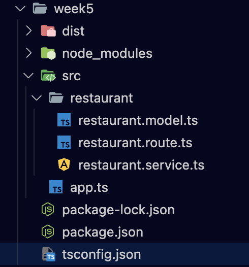

# TypeScript


> ref. [Learn Typescript from Scratch - Jatin Sharma](https://j471n.in/blogs/ts)

2012년 마이크로소프트가 발표한 타입스크립트(TypeScript)는 자바스크립트(JavaScript)를 기반으로 정적 타입 문법을 추가한 프로그래밍 언어입니다. 

이번 시간에는 JavaScript에서 정적 타입 문법을 추가한 TypeScript에 대해서 알아봅시다.

## 공부할 내용 📚

### 1. Why TypeScript?

우리는 왜 JavaScript 대신 TypeScript를 공부해야될까요? 

TypeScript의 특성상 JavaScript로 변환하는 컴파일 과정을 거쳐야하는데, 이런 수고를 하면서까지 TypeScript를 사용해야할 이유가 있을까요?

그 이유에 대해 알아봅시다. (이 부분은 분량이 짧으니 간단하게만 살펴봐주세요!)

- [Why TypeScript?](https://joshua1988.github.io/ts/why-ts.html) : 타입스크립트 핸드북 중 'Why TypeScript?' 파트를 가져왔습니다. 
- [TypeScript는 어떻게 공부해야 하나요?](https://yozm.wishket.com/magazine/detail/1376/) : TypeScript의 탄생배경, 단점과 그 극복과정, 공부하는 방법 등 자세하게 나와있어서 참고하기에 좋은 것 같습니다.

### 2. TypeScript를 배워볼까요

이제 왜 TypeScript를 배워야하는지도 알았으니, 공부해볼 단계입니다!
 
TypeScript는 앞서 살펴보았듯이 JavaScript에 정적 타입을 입힌 언어이기 때문에, 새로운 언어를 공부한다는 부담감을 가질 필요 없이 JavaScript의 확장판을 배운다는 느낌으로 공부하시면 더 편할 것 같습니다.

- [TypeScript 핸드북](https://joshua1988.github.io/ts/) : TypeScript에 대해서 잘 정리해놓은 문서입니다. 
    - 목차 중에서 **Fundamentals** 부분만 보시면 될 것 같습니다.
- [TypeScript Playground](https://www.typescriptlang.org/play) : TypeScript를 직접 실행시켜볼 수 있는 공간입니다.
- [TypeScript 공식문서](https://www.typescriptlang.org/docs/handbook/utility-types.html) : 영어로 되어있기 때문에 필요한 부분만 그때그때 찾아보는 것을 권장합니다.

## 프로젝트 실습 🎈

이번 주차는 저번 주차에서 만들었던 javascript 코드를 typescript 코드로 변환해볼 예정입니다. 실습 이전에 아래 환경설정 단계를 따라서 진행해주세요.

### 환경설정 ⚙️
- 저번 주차와 같이 `npm init`을 해준 뒤, `npm install --save-dev typescript @types/node @types/express`를 통해 TypeScript 관련 모듈을 설치해줍니다.
    - 자바스크립트로 만들어진 써드 파티 라이브러리를 타입스크립트에서 사용하려면 각 기능에 대한 타입이 정의되어 있어야 합니다. 이러한 역할을 해주는 라이브러리가 `@types` 라이브러리입니다.
- 타입스크립트 설정파일인 `tsconfig.json`을 추가해줍니다. (`tsc -init`을 통해 추가해줄 수도 있습니다.)
    - 다양한 옵션이 존재하는데, 자세한 내용은 [컴파일 옵션(다양한 옵션에 대해 한국어로 자세히 설명해줍니다.)](https://yamoo9.gitbook.io/typescript/cli-env/tsconfig), [TypeScript TsConfig Reference](https://www.typescriptlang.org/tsconfig)를 확인하시면 도움이 되실 겁니다.
    - 설정파일은 기본적으로 마음대로 설정하셔도 괜찮습니다. 다양한 옵션들을 설정해보며 어떻게 컴파일이 되는지 이해해보시면 좋을 것 같아요. 밑에 예시 `tsconfig.json`을 남겨두니 참고하세요!
        ```json
        {
            "compilerOptions": {
            "strict": true,
            "module": "commonjs",
            "declaration": true,
            "removeComments": true,
            "allowSyntheticDefaultImports": true,
            "esModuleInterop": true,
            "target": "ES6",
            "sourceMap": true,
            "outDir": "./dist",
            "baseUrl": "./src",
            "incremental": true,

            "noImplicitAny": true, 
            "strictNullChecks": true, 
            "strictFunctionTypes": true,
            },
            "exclude": ["node_modules", "test", "dist", "**/*spec.ts"],

        }
        ```
    - 위와 같이 `tsconfig.json`을 설정해주시고 빌드하시게 되면 밑 사진과 같이 `dist`폴더가 생성되며 안에 변환된 파일이 위치하게 됩니다. (밑 사진은 참고용으로 폴더 구조를 그대로 따라하지 않으셔도 괜찮습니다.)
    <p align="center">
    
    </p>

- 저번 주차에 만들었던 `.js` 파일들을 모두 위 사진처럼 `.ts` 파일로 수정해주세요.
    - 그리고 `tsconfig.json` 파일에서 밑의 설정들을 추가해주세요. (타입 체크를 엄격하는 하는 것과 관련한 설정들입니다.)
        ```json
        {
        "strict": true,
        "strictNullChecks": true,
        "strictFunctionTypes": true,
        "strictBindCallApply": true,
        "strictPropertyInitialization": true,
        "noImplicitThis": true,
        "alwaysStrict": true,
        }
        ```
    - 그럼, 이제 파일에서 빨간 줄이 뜰겁니다. 이 에러들을 고쳐나가보세요.

- 마지막으로, 실행은 `package.json`의 `scripts` 부분에 밑의 명령어를 추가해줍시다.
    ```json
    {
        "start": "node dist/app.js",
        "build": "npx tsc"
    }
    ```
    - `build`는 타입스크립트 파일을 자바스크립트로 변환하고, `start`는 이렇게 변환한 자바스크립트 파일을 실행합니다.