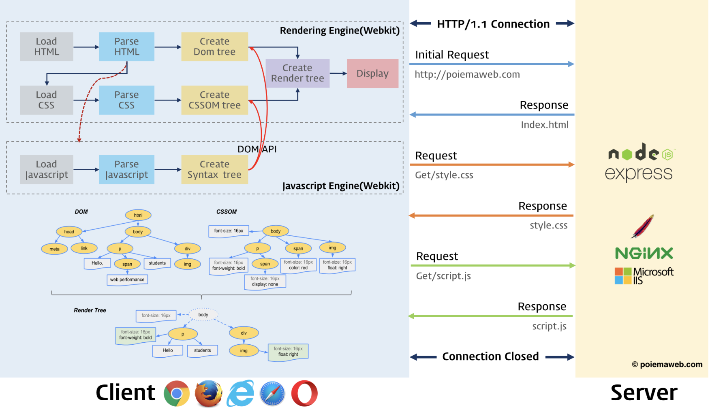

+++
title = "5. REST API & GraphQL"
description = "REST API와 GraphQL을 이용해 외부 데이터를 받아봅니다."
icon = "article"
date = "2023-09-11"
lastmod = "2023-10-05"
weight = 250
+++

지금까지 사용한 포켓몬 데이터를 코드 또는 로컬 파일에서 가져왔어요. 이번 시간에는 외부에서 데이터를 가져오는 방법에 대해 알아보아요!

## 📚 공부할 내용

- Background
  - [HTTP 메소드 총정리](https://inpa.tistory.com/entry/WEB-%F0%9F%8C%90-HTTP-%EB%A9%94%EC%84%9C%EB%93%9C-%EC%A2%85%EB%A5%98-%ED%86%B5%EC%8B%A0-%EA%B3%BC%EC%A0%95-%F0%9F%92%AF-%EC%B4%9D%EC%A0%95%EB%A6%AC)
    - 주요 메소드 위주로 공부해 주세요!
  - [자바스크립트 Promise, async/await](https://javascript.info/async)
- REST API
  - [REST API가 뭔가요? - 얄팍한 코딩사전](https://www.youtube.com/watch?v=iOueE9AXDQQ&ab_channel=%EC%96%84%ED%8C%8D%ED%95%9C%EC%BD%94%EB%94%A9%EC%82%AC%EC%A0%84)
  - Axios
    - HTTP 요청을 보내는 라이브러리에요.
    - [Axios 총정리](https://inpa.tistory.com/entry/AXIOS-%F0%9F%93%9A-%EC%84%A4%EC%B9%98-%EC%82%AC%EC%9A%A9)
    - [React에서 axios 사용하기](https://www.youtube.com/watch?v=9-OrcyggmKQ&ab_channel=%EC%BD%94%EC%A7%80%EC%BD%94%EB%8D%94KossieCoder)
- GraphQL
  - [GraphQL이 뭔가요? - 얄팍한 코딩사전](https://www.youtube.com/watch?v=EkWI6Ru8lFQ&ab_channel=%EC%96%84%ED%8C%8D%ED%95%9C%EC%BD%94%EB%94%A9%EC%82%AC%EC%A0%84)
  - [React에서 Apollo Client로 GraphQL 사용하기](https://www.daleseo.com/graphql-react-apollo-client/)
  
## 프로젝트 실습 🎈

곧 업데이트 예정입니다!
