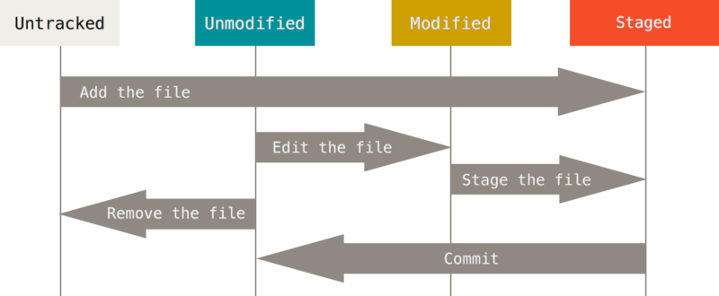

+++
title = "0. Git + GitHub"
description = "Git과 GitHub의 기본 흐름을 익히고, 매주 실습을 제출할 저장소를 준비합니다."
icon = "article"
weight = 305
+++

0주차에는 `README.md`를 `main` 브랜치에 처음으로 push합니다. 스터디 동안 이루어지는 실습은 `feature` 브랜치에서 이어가고, 마지막 주에는 `main`으로 Pull Request를 올려주세요.

## 공부할 내용

### 1. Git과 GitHub

**Git**은 파일의 변경 이력을 관리하는 분산 버전 관리 시스템입니다. Git은 commit할 때 프로젝트의 상태를 스냅샷으로 취급하며, clone한 저장소는 로컬에서도 이력을 관리할 수 있습니다.

**GitHub**는 Git 저장소를 호스팅하고 Pull Request, 리뷰, Actions, Release 같은 협업 기능을 제공하는 서비스입니다. Git과 GitHub는 같은 것이 아닙니다.

아래 질문에 답할 수 있을 때까지 공부하세요.

- 버전 관리가 필요한 이유는 무엇인가요?
- Git이 스냅샷을 기록한다는 것은 무슨 뜻인가요?
- Git과 GitHub는 각각 어떤 역할을 하나요?

#### 참고 자료

- **[Pro Git "Git 기초"](https://git-scm.com/book/ko/v2/%EC%8B%9C%EC%9E%91%ED%95%98%EA%B8%B0-Git-%EA%B8%B0%EC%B4%88)**: Git의 스냅샷 방식과 로컬 작업이 가능한 이유를 설명합니다.
- **[GitHub Docs "GitHub란?"](https://docs.github.com/ko/get-started/start-your-journey/what-is-github)**: Git과 GitHub의 차이, GitHub가 제공하는 협업 기능을 소개합니다.

### 2. 로컬 저장소와 원격 저장소

파일을 수정했다고 바로 Git에 기록되는 것은 아닙니다. 다음 영역과 파일 상태를 구분해야 합니다.

- **Untracked:** Git이 아직 관리하지 않는 새 파일
- **Modified:** 이전 commit 이후 변경된 파일
- **Staged:** 다음 commit에 포함하도록 선택한 파일
- **Committed:** 변경 내용이 로컬 저장소에 기록된 상태

다음 명령의 역할을 알아두세요.

- `git status`: 파일과 브랜치 상태 확인
- `git add <파일>`: 다음 commit에 포함할 변경 선택
- `git diff`, `git diff --staged`: 선택 전·후의 변경 확인
- `git commit`: Staging area의 변경을 로컬에 기록
- `git clone`: 원격 저장소를 로컬에 복제
- `git pull`: 원격 변경을 가져와 현재 브랜치에 반영
- `git push`: 로컬 commit을 원격 저장소에 전송

`origin`은 clone할 때 자동으로 등록되는 원격 저장소의 기본 별칭입니다.

commit은 작업을 무작정 저장하는 단위가 아닙니다. 서로 관련된 변경을 하나로 묶고, 무엇을 변경했는지 알 수 있는 메시지를 작성하세요. Git이 관리할 필요가 없는 파일은 `.gitignore`에 등록합니다. 단, 이미 commit한 파일은 나중에 `.gitignore`에 추가해도 자동으로 기록에서 사라지지 않습니다.



#### 참고 자료

- **[Pro Git "수정하고 저장소에 저장하기"](https://git-scm.com/book/ko/v2/Git%EC%9D%98-%EA%B8%B0%EC%B4%88-%EC%88%98%EC%A0%95%ED%95%98%EA%B3%A0-%EC%A0%80%EC%9E%A5%EC%86%8C%EC%97%90-%EC%A0%80%EC%9E%A5%ED%95%98%EA%B8%B0)**: Tracked·Untracked 파일과 Modified·Staged·Committed 상태를 설명합니다.
- **[Pro Git "리모트 저장소"](https://git-scm.com/book/ko/v2/Git%EC%9D%98-%EA%B8%B0%EC%B4%88-%EB%A6%AC%EB%AA%A8%ED%8A%B8-%EC%A0%80%EC%9E%A5%EC%86%8C.html)**: `origin`, `fetch`, `pull`, `push`로 원격 저장소와 협업하는 흐름을 다룹니다.

### 3. Branch, HEAD, Pull Request

브랜치는 파일 복사본이 아니라 특정 commit을 가리키는 움직이는 포인터입니다. 새 commit을 만들면 현재 브랜치가 새 commit을 가리키도록 이동합니다.

HEAD는 일반적으로 현재 작업 중인 브랜치를 가리킵니다. 브랜치를 전환하면 Working directory의 파일도 해당 브랜치의 상태로 바뀝니다.

브랜치를 나누면 같은 저장소 안에서 여러 작업을 동시에 진행할 수 있지만, 결국 한 브랜치의 변경을 다른 브랜치에 합쳐야 할 때가 옵니다. GitHub에서는 이 병합을 바로 진행하는 대신 **Pull Request(PR)**로 제안합니다. PR은 한 브랜치의 변경을 다른 브랜치에 합쳐 달라고 요청하는 GitHub 기능으로, 변경 내용을 설명하고 리뷰와 자동 검사를 거쳐 merge할 수 있습니다.

#### 참고 자료

- **[Pro Git "브랜치란 무엇인가"](https://git-scm.com/book/ko/v2/Git-%EB%B8%8C%EB%9E%9C%EC%B9%98-%EB%B8%8C%EB%9E%9C%EC%B9%98%EB%9E%80-%EB%AC%B4%EC%97%87%EC%9D%B8%EA%B0%80)**: 브랜치가 가벼운 포인터인 이유와 `HEAD`의 역할을 설명합니다. 문서의 `checkout` 예시는 브랜치 전환에 집중된 `switch`로 바꿔 사용해도 됩니다.
- **[GitHub Docs "Pull Request"](https://docs.github.com/ko/pull-requests/reference/pull-requests)**: PR에서 변경을 제안하고 검토·검증·merge하는 과정을 설명합니다.

---

## 프로젝트 실습

### 실습 A: 저장소 만들고 README.md push하기

**요구사항:**

1. [GitHub](https://github.com/) 계정을 만들고 [Git](https://git-scm.com/downloads)을 설치하세요.
2. commit에 기록될 `user.name`, `user.email`을 설정하세요.
3. 저장소를 만들고 clone 하세요.
4. `README.md`에 스터디 목표와 0~8주차 진행 체크리스트를 작성하세요.
5. `README.md`만 Staging area에 추가하고, 실제 변경 내용을 확인한 뒤 commit하세요.
6. 로컬 `main` 브랜치를 GitHub에 push하고 파일과 commit을 확인하세요.


