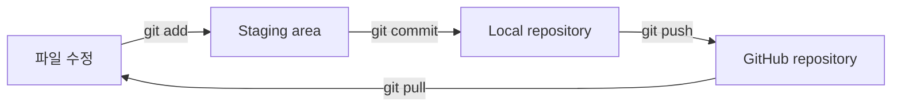

+++
title = "0. Git + GitHub"
description = "Git과 GitHub의 기본 흐름을 익히고, 매주 실습을 제출할 저장소를 준비합니다."
icon = "article"
weight = 305
+++

이번 주에는 앞으로 8주 동안 사용할 **개인 실습 저장소**를 만들어요.

처음에는 Git 용어가 많아 보이지만, 이번 주의 핵심 흐름은 아래 한 줄입니다.

```text
파일 수정 → add → commit → push → GitHub에서 확인
```

0주차에는 `README.md`를 직접 만들어 `main` 브랜치에 처음으로 push합니다. 1주차부터는 `study` 브랜치에서 매주 실습을 이어가고, 마지막 주에는 `study` 브랜치에서 `main` 브랜치로 Pull Request를 올립니다.



---

## Git과 GitHub

### Git

Git은 파일의 변경 이력을 저장하는 **버전 관리 도구**예요. 언제 무엇을 바꿨는지 기록하고, 문제가 생기면 이전 상태와 비교하거나 되돌아갈 수 있게 해줍니다.

### GitHub

GitHub는 Git 저장소를 인터넷에 보관하고 공유하는 서비스예요. 로컬 컴퓨터의 Git 기록을 GitHub에 올려 백업하고, Pull Request로 변경 사항을 검토할 수 있습니다.

Git과 GitHub는 같은 것이 아닙니다.

| 용어 | 의미 |
|---|---|
| Working directory | 현재 직접 수정하고 있는 파일들 |
| Staging area | 다음 commit에 포함하기로 선택한 변경 사항 |
| Local repository | 내 컴퓨터에 저장된 commit 기록 |
| Remote repository | GitHub에 저장된 원격 commit 기록 |



### 꼭 알아둘 명령어

| 명령어 | 하는 일 |
|---|---|
| `git status` | 현재 브랜치와 변경 상태 확인 |
| `git add <파일>` | 다음 commit에 포함할 파일 선택 |
| `git diff --staged` | commit하기 전에 선택한 변경 내용 확인 |
| `git commit -m "메시지"` | 선택한 변경 사항을 로컬에 기록 |
| `git push` | 로컬 commit을 GitHub에 전송 |
| `git pull` | GitHub의 최신 commit을 로컬로 가져오기 |
| `git switch <브랜치>` | 작업할 브랜치 변경 |
| `git log --oneline` | commit 기록을 한 줄씩 확인 |



---

## 시작 전 준비

### 1. 계정과 프로그램 준비

1. [GitHub](https://github.com/) 계정을 만드세요.
2. [Git](https://git-scm.com/downloads)을 설치하세요.
3. 터미널에서 설치 여부를 확인하세요.

```bash
git --version
```

GitHub에 push하려면 인증도 필요합니다. HTTPS를 사용한다면 계정 비밀번호가 아니라 브라우저 로그인, Git Credential Manager, Personal Access Token 또는 GitHub CLI 등의 인증 방식을 사용해야 합니다. 인증 화면이 나타나면 브라우저 로그인을 진행하세요. 설정이 어렵다면 스터디장에게 바로 질문하세요.

### 2. Git 사용자 정보 설정

commit에 기록될 이름과 이메일을 설정합니다. GitHub 계정에서 사용하는 정보를 권장해요.

```bash
git config --global user.name "본인 이름 또는 GitHub 아이디"
git config --global user.email "본인 이메일"
git config --global init.defaultBranch main
```

설정 결과를 확인하세요.

```bash
git config --global --list
```

---

## 실습 1: GitHub 저장소 만들기

1. GitHub 오른쪽 위의 `+` 버튼을 누르고 **New repository**를 선택하세요.
2. 아래와 같이 입력하세요.

| 항목 | 설정 |
|---|---|
| Owner | 본인 GitHub 계정 |
| Repository name | `infra-study-본인아이디` |
| Description | `인프라 스터디 실습 저장소` |
| Visibility | `Public` |
| Add a README file | 선택하지 않음 |
| Add .gitignore | `None` |
| Choose a license | `None` |

3. **Create repository**를 누르세요.



---

## 실습 2: 저장소 clone하기

저장소 페이지의 **Code → HTTPS**에서 URL을 복사한 뒤, 저장소를 내려받습니다.

```bash
git clone https://github.com/<본인아이디>/infra-study-<본인아이디>.git
cd infra-study-<본인아이디>
```

아직 아무 파일도 없는 저장소이므로 `You appear to have cloned an empty repository.`라는 경고가 나와도 정상입니다.

연결된 원격 저장소와 현재 상태를 확인하세요.

```bash
git remote -v
git status
```

- `origin`은 clone할 때 자동으로 붙는 원격 저장소의 기본 별칭입니다.
- `git status`는 작업 전후에 습관처럼 실행하세요.

---

## 실습 3: README.md를 main에 처음 push하기

VS Code나 원하는 편집기로 `README.md` 파일을 만들고 아래 내용을 작성하세요.

```markdown
# Infra Study

인프라 스터디 실습 내용을 기록하는 저장소입니다.

## 목표

- Linux부터 CI/CD까지 하나의 서비스를 발전시키며 학습합니다.
- 매주 실습 과정과 결과를 기록합니다.

## 진행 상황

- [x] 0주차: Git + GitHub
- [ ] 1주차: Linux + HTTP + Node.js
- [ ] 2주차: 네트워크 기초
- [ ] 3주차: Docker
- [ ] 4주차: AWS - IAM, VPC, EC2
- [ ] 5주차: AWS - S3, CloudFront, ALB
- [ ] 6주차: Kubernetes
- [ ] 7주차: Terraform
- [ ] 8주차: GitHub Actions
```

이제 변경 내용을 확인하고 commit합니다.

```bash
git branch -M main
git status
git add README.md
git commit -m "docs: add study README"
```

commit이 만들어졌다면 GitHub에 처음으로 push합니다.

```bash
git push origin main
```

`origin main`은 로컬 `main`과 GitHub의 `main`을 연결합니다. 이후 같은 브랜치에서는 `git push`만 실행해도 됩니다.

GitHub 저장소 페이지를 새로고침하고 아래 항목을 확인하세요.

- `README.md`가 보이는가?
- commit 메시지가 `docs: add study README`인가?
- 브랜치가 `main`인가?

---

## 실습 4: 매주 사용할 study 브랜치 만들기

0주차 README 이후부터는 `main`에 직접 push하지 않습니다. 1~8주차 실습은 하나의 `study` 브랜치에 차례대로 쌓습니다.

```bash
git checkout -b study
git push origin study
```

현재 브랜치를 확인하세요. 별표가 붙은 브랜치가 현재 작업 중인 브랜치입니다.

```bash
git branch
```

```text
  main
* study
```



---

## 매주 제출하는 방법

매주 실습은 기존 프로젝트를 계속 발전시키는 방식입니다. 주차별 코드를 복사해서 별도 폴더에 넣기보다, 실제 파일은 계속 수정하고 `docs/week-N.md`에 그 주의 과정과 결과를 남기세요.


## 절대 push하면 안 되는 파일

AWS를 다루기 시작하면 저장소에 올려서는 안 되는 값이 생깁니다. **Public 저장소뿐 아니라 Private 저장소에도 비밀값을 commit하지 않는 습관**을 들이세요.

- 비밀번호, API Key, Access Key, Secret Key, Token
- `.env`와 실제 환경 변수 파일
- AWS 자격 증명 파일
- `.pem`, 개인 SSH Key
- Terraform의 `*.tfstate`, `*.tfstate.*`
- `node_modules/`와 불필요한 빌드 결과물

프로젝트에 맞는 `.gitignore`를 작성하고, commit 전에는 항상 아래 명령으로 실제 올라갈 내용을 확인하세요.

```bash
git status
git diff --staged
```



---

## 마지막 주: main으로 Pull Request 올리기

8주차 실습까지 `study`에 push한 뒤 최종 변경 사항을 확인합니다.

```bash
git switch study
git status
git log --oneline main..study
git diff --stat main...study
git push
```

`git status`가 `nothing to commit, working tree clean`인지 확인한 후 GitHub에서 PR을 만드세요.

1. 저장소의 **Pull requests** 탭으로 이동합니다.
2. **New pull request**를 누릅니다.
3. `base: main`, `compare: study`로 설정합니다.
4. **Create pull request**를 누릅니다.
5. 아래 형식으로 제목과 본문을 작성하고 PR을 생성합니다.

```text
제목: [Infra Study] 본인 이름 최종 제출

## 완료한 실습
- [ ] 1주차 Linux + HTTP + Node.js
- [ ] 2주차 네트워크 기초
- [ ] 3주차 Docker
- [ ] 4주차 AWS - IAM, VPC, EC2
- [ ] 5주차 AWS - S3, CloudFront, ALB
- [ ] 6주차 Kubernetes
- [ ] 7주차 Terraform
- [ ] 8주차 GitHub Actions

## 최종 결과
- 서비스 URL:
- 주요 구성:

## 가장 많이 배운 점
-

## 리뷰어가 확인할 점
-
```

PR을 만든 뒤에는 바로 merge하지 말고 리뷰를 기다리세요. 수정 요청을 받으면 `study` 브랜치에서 수정하고 다시 commit하여 push합니다. 열려 있는 PR은 자동으로 최신 commit을 반영합니다.

```bash
git switch study
# 요청받은 내용 수정
git add <수정한 파일>
git diff --staged
git commit -m "fix: address review feedback"
git push
```

리뷰가 끝나면 스터디장의 안내에 따라 PR을 merge합니다. 이 PR이 한 학기 동안 쌓은 실습의 최종 결과물입니다.

---

## 0주차 제출 체크리스트

- [ ] GitHub 계정과 Git을 준비했다.
- [ ] Git 사용자 이름과 이메일을 설정했다.
- [ ] `infra-study-본인아이디` Public 저장소를 만들었다.
- [ ] 로컬에서 작성한 `README.md`를 `main`에 push했다.
- [ ] `study` 브랜치를 만들고 GitHub에 push했다.
- [ ] GitHub에서 `main`, `study` 두 브랜치를 확인했다.
- [ ] 저장소 URL을 제출했다.

## 참고 자료

- [Pro Git 한국어판](https://git-scm.com/book/ko/v2)
- [GitHub Docs: 새 저장소 만들기](https://docs.github.com/ko/repositories/creating-and-managing-repositories/creating-a-new-repository)
- [GitHub Docs: 저장소 복제하기](https://docs.github.com/ko/repositories/creating-and-managing-repositories/cloning-a-repository)
- [GitHub Docs: 원격 저장소에 commit push하기](https://docs.github.com/ko/get-started/using-git/pushing-commits-to-a-remote-repository)
- [GitHub Docs: Pull Request 만들기](https://docs.github.com/ko/pull-requests/collaborating-with-pull-requests/proposing-changes-to-your-work-with-pull-requests/creating-a-pull-request)
