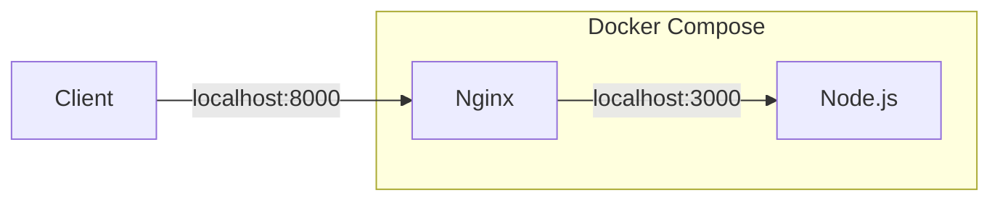
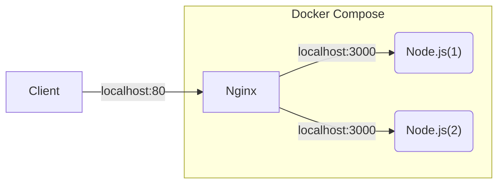

+++
title = "3. Docker"
description = "컨테이너 기반 가상화 도구인 Docker에 대해 알아봅니다."
icon = "article"
date = "2023-09-11"
lastmod = "2023-10-05"
weight = 330
+++

<!-- TODO: update `date` and `lastmod` -->

이번 주차부터는 본격적으로 인프라다운(!) 주제를 공부해볼 거예요. 요즘 배포할 때 빼놓을 수 없는 Docker는 응용프로그램을 격리해주는 컨테이너를 관리해줍니다. 가볍고 빠른 가상머신으로 생각하면 될 거예요.

이번 주차에는 Docker가 무엇인지와 왜 쓰는지를 이해하고, Docker CLI와 Docker Compose로 컨테이너를 관리해볼 거예요.

## 공부할 내용 📚

### 1. Docker

서버를 배포할 때 가장 문제를 많이 일으키는 부분 중 하나는 개발 환경과 서버 환경의 차이입니다. 이를 막기 위해서 기존에는 VMWare 같은 가상 머신을 주로 사용하였다면, 요즘은 더 빠르고 가벼운 컨테이너인 Docker를 많이 사용합니다. Docker는 환경 문제나 보안, 성능 등 다양한 문제를 해결해줍니다.

우선 [Docker 설치 가이드](../reference/Install%20Docker.md)를 참고해서 설치해주세요.

- Docker가 무엇인지, 기존의 가상머신과의 차이점을 이해합니다.
- Docker CLI를 이용하여 컨테이너를 관리하는 방법을 배웁니다.  
  (알아볼 명령어: run, ps, stop, rm, exec, logs, images, pull)
- Docker Compose를 이용하여 여러 컨테이너를 관리하는 방법을 배웁니다.  
  (알아볼 속성: image, build, command, ports, volumes, environment, depends_on, restart, networks)
- Dockerfile을 이용하여 이미지를 만들고 배포해봅니다.  
  (알아볼 속성: FROM, RUN, COPY, CMD, ENV, WORKDIR, ENTRYPOINT, ADD, HEALTHCHECK)

> 더 공부해보면 좋을 것들(선택): Docker Best Practices

#### 참고 자료

- **[노마드코더 "Docker 가 왜 좋은지 5분안에 설명해줌" (약 5분)](https://youtu.be/chnCcGCTyBg?si=FWg6DVKfOjTCgCOb)**: 도커가 무엇인지, 왜 쓰는지를 간단하게 설명해줍니다.
- **[subicura "초보를 위한 도커 안내서" (글)](https://subicura.com/2017/01/19/docker-guide-for-beginners-1.html)**: 도커 입문 때 빼놓을 수 없는 자료로 언급되는 글입니다. 총 세 편으로 이루어져있고, 튜토리얼도 차근차근 설명되어있어 추천드립니다. ([2편](https://subicura.com/2017/01/19/docker-guide-for-beginners-2.html), [3편](https://subicura.com/2017/02/10/docker-guide-for-beginners-create-image-and-deploy.html))
- **[Freecodecamp "Docker Tutorial for Beginners" (약 2시간)](https://youtu.be/fqMOX6JJhGo?si=rud5_lyC_N53ZO7x)**: 영상이 더 편한 분들을 위한 강의입니다.

### 2. Nginx

Nginx는 웹 서버로, 요즘은 대부분의 서버가 Nginx를 사용합니다. Nginx는 매우 빠르고 확장성이 좋아서 많이 사용됩니다. Nginx의 주 용도인 reverse proxy와 load balancing을 배우고, Nginx를 설정하는 방법을 알아봅니다.

- Nginx의 역할과 특징을 이해합니다.
- Proxy(reverse vs. forward)와 Load Balancing의 개념을 이해합니다.
- Nginx를 설치하고 설정하는 방법을 배웁니다.

> [!WARNING]  
> Nginx 연습은 Docker로 하는 걸 권장합니다! 로컬에 설치한 Nginx는 기존에 설치된 서버와 충돌할 수 있고, 원복이 어려울 수 있습니다. [Nginx 이미지](https://hub.docker.com/_/nginx)로 컨테이너를 만들고, 로컬의 nginx.conf 파일을 볼륨으로 연결해보세요.

#### 참고 자료

- **[우아한테크 "피케이의 Nginx" (약 16분)](https://youtu.be/6FAwAXXj5N0?si=G7JUxntHPVx7L8gb)**: 웹 서버의 역사와 Nginx의 특징을 간단하게 설명해줍니다.
- **[Nginx 공식 문서](https://nginx.org/en/docs/beginners_guide.html)**: Nginx 공식 문서입니다. 영어로 되어있지만, 매우 자세하게 설명되어있어서 참고하기 좋습니다. (Beginner's guide 읽어주세요!)
- **["docker로 nginx 설정하기" (글)](https://middleearth.tistory.com/49)**: Docker로 Nginx를 설정하는 방법을 설명한 글입니다.

#### 더 공부하면 좋을 서비스: Caddy (선택)

Caddy는 Nginx보다 사용하기 쉽고 빨라요! 스꾸딩에서도 최근부터 Caddy를 사용하고 있어요. 다만 Nginx에 비해 검색할 수 있는 자료가 적어서, 입문자가 배우기에 조금 더 적합한 Nginx를 스터디 내용에 넣었습니다. Caddy에 관심이 있다면 공부해보면 좋고, 실습도 Caddy로 구현하면 더 좋습니다! ([Caddy 공식 문서](https://caddyserver.com/docs/))

## 프로젝트 실습 🎈

지난 번에 만든 Express 어플리케이션을 Dockerize(Docker Image를 만들어서 배포)해봅니다. Express만 Dockerize하면 재미없죠...! Nginx도 Dockerize해서 Express 앞에 두고, Nginx가 Express로 요청을 전달하도록 설정해봅니다. (Reverse Proxy로 쓸 거예요!)

- docker-compose.yml 파일을 작성해주세요.
- Express 어플리케이션을 수정해주세요!
  - Express 어플리케이션의 포트를 3000번으로 변경해주세요.
  - HTML을 반환하는 endpoint는 없애주세요. Nginx가 HTML을 반환하도록 해주세요! (`GET /`)
- Express 어플리케이션을 Dockerize합니다. [공식 Node.js Docker Image](https://hub.docker.com/_/node/)를 Dockerfile에서 `FROM`으로 사용해주세요.
- Nginx 이미지는 공식 이미지를 그대로 사용하면 됩니다. nginx.conf와 index.html 파일을 볼륨으로 연결해주세요. (week2.html의 이름을 변경해주세요!)

> [!NOTE]  
> **Dockerize란,** 서비스 코드와 의존성을 container에 담는 Dockerfile을 작성하고, Docker CLI를 이용하여 이미지를 빌드하고 컨테이너를 실행하는 과정입니다.

> **Challenge! 🔥 (선택)**  
> Express 컨테이너를 두 개 띄우고, Nginx(또는 Caddy)에서 load balancing 기능을 사용해보세요.  
> Hint: Node.js의 포트를 외부로 노출하면 충돌이 나겠죠? 노출시키지 않고 컨테이너끼리 요청을 주고받는 방법을 알아보세요!

