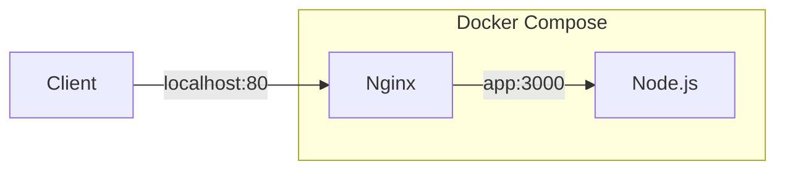

+++
title = "3. Docker"
description = "컨테이너 기반 가상화 도구인 Docker를 배우고, 앱을 컨테이너화합니다."
icon = "article"
weight = 330
+++

이번 주부터 본격적으로 인프라다운(!) 주제를 다뤄요. **Docker**는 애플리케이션을 격리된 컨테이너로 패키징하고 실행하는 도구예요.

이번 주에는 Session 1에서 만든 Node.js 서버를 **Docker 컨테이너**로 패키징하고, **Nginx를 리버스 프록시**로 앞에 두고, **Docker Compose**로 한 번에 관리해볼 거예요.

## 공부할 내용

### 1. Docker 기초

Session 1에서 만든 서버를 다른 컴퓨터에서도 실행하려면? Node.js를 설치하고, 버전 맞추고, 코드를 복사하고... Docker가 이 문제를 해결해요.

아래 질문에 답할 수 있을 때까지 공부하세요:

- 이미지(Image)와 컨테이너(Container)의 관계는? (힌트: 클래스와 인스턴스)
- 컨테이너가 VM보다 가벼운 이유는?
- `-p 8080:80` 옵션은 무엇을 의미하나? Session 2에서 배운 포트 개념과 어떻게 연결되나?


- `docker run`, `docker ps`, `docker logs`, `docker exec` — 기본 CLI는 직접 사용해보면서 익히세요.

#### 참고 자료

- **[subicura "초보를 위한 도커 안내서" (글)](https://subicura.com/2017/01/19/docker-guide-for-beginners-1.html)**: 도커 입문에 빼놓을 수 없는 자료입니다. ([2편](https://subicura.com/2017/01/19/docker-guide-for-beginners-2.html), [3편](https://subicura.com/2017/02/10/docker-guide-for-beginners-create-image-and-deploy.html))
- **[코딩애플 "Docker 개념" (약 6분)](https://www.youtube.com/watch?v=e0koWWAmXSk)**: Docker가 무엇인지 빠르게 설명합니다. 재밌습니다.

### 2. Dockerfile

Dockerfile은 이미지를 만드는 레시피예요. 핵심 명령어 다섯 가지를 이해하세요: `FROM`, `WORKDIR`, `COPY`, `RUN`, `CMD`.

특히 **`RUN`은 빌드할 때, `CMD`는 실행할 때** — 이 차이가 가장 중요해요.

그리고 **레이어 캐싱**을 이해하세요: Dockerfile에서 명령어 순서를 어떻게 잡느냐에 따라 빌드 속도가 크게 달라져요. `package.json`을 소스 코드보다 먼저 복사하는 이유를 알아보세요.

기타 알아두면 좋은 것: `ENTRYPOINT`, `ENV`, `EXPOSE`, `.dockerignore`

### 3. Docker Compose

여러 컨테이너를 하나의 YAML 파일로 정의하고 한 번에 관리하는 도구예요.

알아야 할 설정: `image`, `build`, `ports`, `volumes`, `environment`, `depends_on`, `networks`

알아야 할 명령어: `docker compose up -d`, `docker compose down`, `docker compose logs`

### 4. Nginx (리버스 프록시)

Nginx는 웹 서버이자 리버스 프록시예요.

Node.js만으로도 HTTP 요청을 처리할 수 있는데, 왜 앞에 Nginx를 하나 더 두는 걸까요? Nginx는 느린 클라이언트의 연결을 **버퍼링**해서 완성된 요청만 Node.js에 전달해요. Node.js가 느린 클라이언트를 직접 상대하지 않아도 되니 연결이 빨리 해제되고, 더 많은 요청을 처리할 수 있게 돼요. 이 외에도 정적 파일을 직접 서빙하거나, 여러 서버에 트래픽을 분산하는 등 앞에서 **방패** 역할을 해요.

Nginx가 하는 주요 역할: **리버스 프록시**, **정적 파일 서빙**, **로드 밸런싱**



#### 참고 자료

- **[우아한테크 "피케이의 Nginx" (약 16분)](https://youtu.be/6FAwAXXj5N0?si=G7JUxntHPVx7L8gb)**: Nginx의 특징을 설명합니다.
- **[Nginx 공식 문서 Beginner's Guide](https://nginx.org/en/docs/beginners_guide.html)**: 공식 입문 가이드입니다.



---

## 프로젝트 실습

### Docker 설치

[Docker 설치 가이드](./Install%20Docker.md)를 참고하여 본인 로컬 환경에 Docker를 설치해주세요.

### Step 1: Node.js 앱 Dockerize

Session 1에서 만든 서버(`server.js`)를 Docker로 컨테이너화해보세요.

**요구사항:**

1. `Dockerfile`을 작성하세요. `FROM node:22-alpine`을 베이스 이미지로 사용하세요.
2. `.dockerignore` 파일을 만들어 불필요한 파일(`.git` 등)을 제외하세요.
3. 이미지를 빌드하고 컨테이너로 실행해보세요.

```bash
docker build -t my-server:v1 .
docker run -d -p 3000:3000 --name my-server my-server:v1

# 테스트
curl http://localhost:3000/
curl http://localhost:3000/api/info
curl http://localhost:3000/health
```

### Step 2: Docker Compose + Nginx

이제 Node.js 앱 앞에 **Nginx 리버스 프록시**를 두고, Docker Compose로 함께 관리해보세요.


```mermaid
flowchart LR
  subgraph Docker Compose
    Nginx -- "app:3000" --> Node.js
  end
  Client -- "localhost:80" --> Nginx
```

**요구사항:**

1. `compose.yaml`을 작성하세요. `app`(Node.js 서버)과 `nginx` 두 서비스를 정의하세요.
2. `nginx.conf`를 작성하세요. 모든 요청을 `app:3000`으로 프록시하도록 설정하세요.
3. Nginx(80)를 통해 접속이 되는지 확인하세요.

```bash
docker compose up -d
curl http://localhost/
curl http://localhost/api/info
curl http://localhost/health
```

### 실험해보기

1. **컨테이너 네트워크 탐색:** `docker exec -it <app-container> sh`로 컨테이너 안에 들어가서 `/etc/resolv.conf`, `ip addr`를 확인해보세요. Session 2에서 배운 DNS와 IP 개념이 컨테이너 내부에서도 동일하게 동작해요.

2. **앱 컨테이너 중단:** `docker compose stop app` 후 `curl http://localhost/`를 보내보세요. Nginx가 어떤 응답을 반환하나요?

3. **포트 없이 실행:** `app` 서비스에서 `ports`를 제거해보세요. 외부에서 직접 3000번으로 접속 불가, 하지만 Nginx를 통해서는 접속 가능. Docker 네트워크 내부에서는 포트 공개 없이도 컨테이너끼리 통신 가능해요.

> **Challenge! (선택)**
> Node.js 컨테이너를 **두 개** 띄우고, Nginx에서 **load balancing**을 설정해보세요. `docker compose up --scale app=2`를 사용해보세요!
