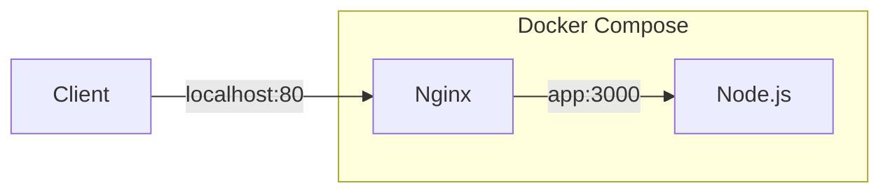

+++
title = "3. Docker"
description = "컨테이너 기반 가상화 도구인 Docker를 배우고, 앱을 컨테이너화합니다."
icon = "article"
weight = 330
+++

이번 주부터 본격적으로 인프라다운(!) 주제를 다뤄요. **Docker**는 애플리케이션을 격리된 컨테이너로 패키징하고 실행하는 도구예요.

이번 주에는 Session 1에서 만든 Node.js 서버를 **Docker 컨테이너**로 패키징하고, **Nginx를 리버스 프록시**로 앞에 두고, **Docker Compose**로 한 번에 관리해볼 거예요.

## 공부할 내용

### 1. Docker 기초

#### 왜 Docker를 쓰나?

Session 1에서 만든 서버를 다른 컴퓨터에서도 실행하려면? Node.js를 설치하고, 버전 맞추고, 코드를 복사하고... Docker가 이 문제를 해결해요.

- **이미지(Image):** 앱 코드 + 런타임 + 의존성을 하나로 묶은 패키지 (읽기 전용)
- **컨테이너(Container):** 이미지를 실행한 인스턴스 (프로세스)
- **비유:** 이미지 = 클래스, 컨테이너 = 인스턴스. 하나의 이미지로 여러 컨테이너를 실행 가능.

#### 컨테이너 vs 가상 머신

| | 가상 머신 (VM) | 컨테이너 |
|---|---|---|
| 격리 방식 | 하이퍼바이저 위에 별도 OS | 호스트 커널 공유 + Namespace/Cgroup |
| 크기 | 수 GB | 수십~수백 MB |
| 시작 시간 | 수 분 | 수 초 |
| 오버헤드 | 큼 | 작음 |

컨테이너가 가벼운 이유: VM은 통째로 별도 OS를 올리지만, 컨테이너는 호스트 OS의 커널을 같이 쓰면서 각 컨테이너가 자기만의 파일 시스템, 네트워크, 프로세스 목록을 가진 것처럼 격리해줘요. OS를 새로 부팅할 필요가 없으니 빠르고 가볍죠. (이 격리를 가능하게 하는 Linux 기능이 Namespace와 Cgroup인데, 지금은 이름만 알아두면 돼요.)

#### Docker CLI 핵심 명령어

```bash
docker pull nginx              # 이미지 다운로드
docker run -d -p 8080:80 nginx # 컨테이너 실행 (-d=백그라운드, -p=포트매핑)
docker ps                      # 실행 중인 컨테이너 목록
docker ps -a                   # 정지된 것 포함
docker logs <id>               # 로그 보기
docker exec -it <id> /bin/sh   # 컨테이너 안에 셸 접속
docker stop <id>               # 정지
docker rm <id>                 # 삭제
docker images                  # 로컬 이미지 목록
```

**포트 매핑 `-p 8080:80`:** 호스트의 8080번 포트 → 컨테이너의 80번 포트. Session 2에서 배운 포트와 바인딩 개념이 그대로 적용돼요.

#### 참고 자료

- **[subicura "초보를 위한 도커 안내서" (글)](https://subicura.com/2017/01/19/docker-guide-for-beginners-1.html)**: 도커 입문에 빼놓을 수 없는 자료입니다. ([2편](https://subicura.com/2017/01/19/docker-guide-for-beginners-2.html), [3편](https://subicura.com/2017/02/10/docker-guide-for-beginners-create-image-and-deploy.html))
- **[코딩애플 "Docker 개념" (약 6분)](https://www.youtube.com/watch?v=e0koWWAmXSk)**: Docker가 무엇인지 빠르게 설명합니다.

### 2. Dockerfile

Dockerfile은 이미지를 만드는 레시피예요. 간단한 예시를 보면서 핵심 명령어를 익혀보세요.

```dockerfile
# 1. 베이스 이미지 지정 — 이 이미지 위에 우리 앱을 올림
FROM node:22-alpine

# 2. 작업 디렉토리 설정 — 이후 명령어가 이 경로에서 실행됨
WORKDIR /app

# 3. 의존성 파일만 먼저 복사
COPY package.json package-lock.json ./

# 4. 의존성 설치 — 이미지 빌드 시점에 실행되는 명령어
RUN npm install

# 5. 나머지 소스 코드 복사
COPY . .

# 6. 컨테이너가 시작될 때 실행할 명령어
CMD ["node", "server.js"]
```

| 명령어 | 역할 |
|---|---|
| `FROM` | 베이스 이미지를 지정. 모든 Dockerfile은 이것으로 시작 |
| `WORKDIR` | 컨테이너 내부의 작업 디렉토리 설정. `cd`와 비슷 |
| `COPY` | 호스트의 파일을 컨테이너 안으로 복사 |
| `RUN` | 이미지 **빌드 시점**에 실행할 명령어 (설치, 빌드 등) |
| `CMD` | 컨테이너 **실행 시점**에 실행할 명령어 |

`RUN`은 빌드할 때, `CMD`는 실행할 때 — 이 차이가 가장 중요해요.

#### 레이어 캐싱

위 예시에서 `package.json`을 소스 코드보다 **먼저** 복사한 이유가 있어요. Docker는 Dockerfile의 각 명령어를 **레이어**로 저장하고, 변경이 없는 레이어는 캐시를 재사용해요.

소스 코드는 자주 바뀌지만, `package.json`은 의존성을 추가하지 않는 한 거의 안 바뀌죠. 만약 `COPY . .`을 먼저 하면 코드가 바뀔 때마다 `npm install`도 매번 다시 실행돼요. 순서를 나누면 의존성 설치 레이어를 캐시에서 재사용할 수 있어서 빌드가 훨씬 빨라져요.

#### 기타 명령어

아래 명령어도 알아두면 좋아요. 실습에서 필요할 때 찾아보세요.

- `ENTRYPOINT` — `CMD`와 비슷하지만, 컨테이너를 하나의 실행 파일처럼 동작하게 만들 때 사용
- `ENV` — 환경 변수 설정
- `EXPOSE` — 컨테이너가 사용하는 포트를 문서화 (실제 포트를 열지는 않음)
- `.dockerignore` — `.gitignore`와 같은 역할. `.git`, `node_modules` 등 이미지에 불필요한 파일을 제외

### 3. Docker Compose

여러 컨테이너를 하나의 YAML 파일로 정의하고 한 번에 관리하는 도구예요.

- `image`, `build`, `ports`, `volumes`, `environment`, `depends_on`, `networks`
- `docker compose up -d`, `docker compose down`, `docker compose logs`

### 4. Nginx (리버스 프록시)

Nginx는 웹 서버이자 리버스 프록시예요.

#### 왜 Node.js 앞에 Nginx를 두나?

Node.js만으로도 HTTP 요청을 처리할 수 있는데, 왜 앞에 Nginx를 하나 더 두는 걸까요? Node.js는 싱글 스레드로 동작하기 때문에, 응답이 느린 클라이언트가 연결을 오래 물고 있으면 다른 요청 처리에 영향을 줄 수 있어요. Nginx는 이런 동시 연결 수천 개를 효율적으로 처리하도록 설계되어 있어서, 앞에서 요청을 받아 Node.js에 넘겨주는 **방패** 역할을 해요.

- **리버스 프록시:** 클라이언트 요청을 받아서 뒤에 있는 Node.js 서버로 전달
- **정적 파일 서빙:** HTML, CSS, JS를 Nginx가 직접 반환 (Node.js 부하 감소)
- **로드 밸런싱:** 여러 Node.js 인스턴스에 요청을 분배

#### 참고 자료

- **[우아한테크 "피케이의 Nginx" (약 16분)](https://youtu.be/6FAwAXXj5N0?si=G7JUxntHPVx7L8gb)**: Nginx의 특징을 설명합니다.
- **[Nginx 공식 문서 Beginner's Guide](https://nginx.org/en/docs/beginners_guide.html)**: 공식 입문 가이드입니다.



---

## 프로젝트 실습

### Docker 설치

[Docker 설치 가이드](./Install%20Docker.md)를 참고하여 본인 로컬 환경에 Docker를 설치해주세요.

### Step 1: Node.js 앱 Dockerize

Session 1에서 만든 서버(`server.js`)를 Docker로 컨테이너화해보세요.

1. `Dockerfile`을 작성하세요. `FROM node:22-alpine`을 베이스 이미지로 사용하세요.
2. `.dockerignore` 파일을 만들어 불필요한 파일(`.git` 등)을 제외하세요.
3. 이미지를 빌드하고 컨테이너로 실행해보세요.

```bash
docker build -t my-server:v1 .
docker run -d -p 3000:3000 --name my-server my-server:v1

# 테스트
curl http://localhost:3000/
curl http://localhost:3000/health
```



### Step 2: Docker Compose + Nginx

이제 Node.js 앱 앞에 **Nginx 리버스 프록시**를 두고, Docker Compose로 함께 관리해보세요.


```mermaid
flowchart LR
  subgraph Docker Compose
    Nginx -- "app:3000" --> Node.js
  end
  Client -- "localhost:80" --> Nginx
```

1. `compose.yaml`을 작성하세요. `app`(Node.js 서버)과 `nginx` 두 서비스를 정의하세요.
2. `nginx.conf`를 작성하세요. 모든 요청을 `app:3000`으로 프록시하도록 설정하세요.
3. 실행하고 테스트해보세요.

```bash
docker compose up -d
docker compose ps              # 모든 서비스 상태 확인
docker compose logs -f app     # 앱 로그 추적

# Nginx(80)를 통해 접속
curl http://localhost/
curl http://localhost/health
```

### 실험해보기

1. **컨테이너 네트워크 탐색:**
   ```bash
   docker exec -it <app-container> sh
   cat /etc/resolv.conf          # Docker 내부 DNS 확인
   ip addr                        # 컨테이너의 IP 확인 (172.x.x.x)
   ```
   Session 2에서 배운 DNS와 IP 개념이 컨테이너 내부에서도 동일하게 동작해요.

2. **앱 컨테이너 중단:** `docker compose stop app` 후 `curl http://localhost/`를 보내보세요. Nginx가 어떤 응답을 반환하나요?

3. **포트 없이 실행:** `app` 서비스에서 `ports`를 제거해보세요. 외부에서 직접 3000번으로 접속 불가, 하지만 Nginx를 통해서는 접속 가능. Docker 네트워크 내부에서는 포트 공개 없이도 컨테이너끼리 통신 가능해요.

> **Challenge! (선택)**
> Node.js 컨테이너를 **두 개** 띄우고, Nginx에서 **load balancing**을 설정해보세요. `docker compose up --scale app=2`를 사용해보세요!
