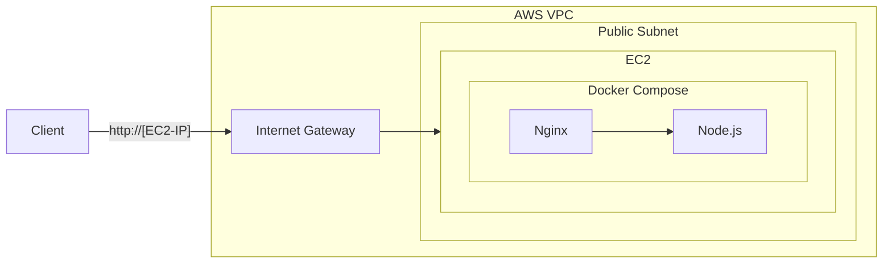

+++
title = "4. AWS: IAM, VPC, EC2"
description = "AWS의 기본 서비스인 IAM, VPC, EC2를 배우고 Docker 앱을 클라우드에 배포합니다."
icon = "article"
weight = 340
+++

AWS(Amazon Web Services)는 전 세계에서 가장 많이 사용되는 클라우드 플랫폼이에요. 이번 주부터 2주간 AWS를 배울 거예요.

이번 주에는 **IAM으로 보안 설정**을 하고, **VPC로 네트워크를 설계**한 뒤, **EC2 인스턴스에 Docker 앱을 배포**합니다. Session 2에서 배운 네트워크 개념이 AWS에서 어떻게 적용되는지 직접 확인하게 될 거예요.



## 사전 준비

- **AWS 계정 생성:** https://console.aws.amazon.com/ 에서 Free Tier 계정을 만드세요.
- **MFA 설정:** Root 계정에 반드시 MFA(Multi-Factor Authentication)를 설정하세요.
- **Billing Alarm 설정:** $5 이상 과금 시 알림을 받도록 설정하세요.
- **AWS CLI 설치:** https://docs.aws.amazon.com/ko_kr/cli/latest/userguide/getting-started-install.html

## 공부할 내용

### 1. IAM — 가장 먼저 배워야 할 것

IAM(Identity and Access Management)은 AWS에서 **누가 무엇을 할 수 있는지** 관리하는 서비스예요. EC2보다 먼저 배우는 이유: IAM을 모르면 모든 것을 root 계정으로 하게 되고, 그건 보안 사고의 시작이에요.

아래 개념들의 차이를 이해하세요:
- **Root 계정** vs **IAM User** — 왜 Root 계정을 일상적으로 쓰면 안 되나?
- **IAM Policy** vs **IAM Role** — Policy는 "규칙"이고, Role은 "서비스가 맡는 권한"이에요. 사람이 아니라 EC2 인스턴스나 Lambda 같은 서비스가 다른 AWS 리소스에 접근할 때 Role을 사용해요.
- **최소 권한 원칙** — 학습 중에는 AdministratorAccess를 쓰되, 프로덕션에서는 절대 안 돼요.

#### 참고 자료

- **[AWS "IAM 작동 방식"](https://docs.aws.amazon.com/ko_kr/IAM/latest/UserGuide/intro-structure.html)**: IAM User, Role, Policy의 관계와 인증/인가 흐름을 설명하는 공식 문서입니다.

### 2. VPC — 네트워크 설계

VPC(Virtual Private Cloud)는 AWS 안에서 **나만의 격리된 네트워크**예요. Session 2에서 배운 IP, 서브넷, NAT, 방화벽이 여기서 그대로 적용됩니다.

| Session 2 개념 | AWS에서 대응하는 것 |
|---------------|------------------|
| CIDR / 서브넷 | VPC CIDR + Subnet |
| Public vs Private IP | Public Subnet (IGW 연결) vs Private Subnet |
| NAT | NAT Gateway (Private → 인터넷 나가기) |
| 방화벽 (Stateful) | Security Group |
| 방화벽 (Stateless) | Network ACL (NACL) |
| 라우팅 테이블 | Route Table |

알아야 할 것:
- **Availability Zone (AZ):** 최소 2개 AZ에 서브넷을 두는 게 왜 기본인지
- **Public Subnet vs Private Subnet:** Route Table에 IGW 경로가 있느냐 없느냐의 차이
- **Internet Gateway vs NAT Gateway:** 각각 언제 필요한지

#### 참고 자료

- **[AWS "VPC 작동 방식"](https://docs.aws.amazon.com/vpc/latest/userguide/how-it-works.html)**: VPC, 서브넷, 라우트 테이블, 게이트웨이를 설명하는 공식 문서입니다.
- **[VPC 상세 설명 영상 (약 46분)](https://youtu.be/R1UWYQYTPKo?si=RzDLMDB2E2ulDJRi)**: VPC를 깊이 이해하고 싶다면 추천합니다.

### 3. EC2 — 서버 인스턴스

EC2(Elastic Compute Cloud)는 가상 서버를 대여하는 서비스예요.

알아야 할 것: Instance Type, AMI, Key Pair, Elastic IP





#### 참고 자료

- **[생활코딩 "AWS - EC2 기본 사용법" (약 15분)](https://youtu.be/Pv2yDJ2NKQA?si=QaQlK6SNN_hZ03Cx)**: EC2 실습 영상입니다. UI가 최신은 아니지만 흐름은 동일해요.
- **[AWS "탄력적 IP 주소"](https://docs.aws.amazon.com/vpc/latest/userguide/vpc-eips.html)**: Elastic IP의 개념, 할당, 과금 정책을 설명하는 공식 문서입니다.

---

## 프로젝트 실습

### Step 1: IAM User 만들기

Root 계정 대신 사용할 IAM User를 만드세요.

**요구사항:**
- Console 로그인 활성화
- `AdministratorAccess` 정책 연결 (학습용)
- Access Key 생성 후 `aws configure`로 등록



### Step 2: VPC 구성

아래 구조의 VPC를 직접 설계하고 만드세요.

**요구사항:**
- VPC CIDR: `10.0.0.0/16`
- Public Subnet 2개 + Private Subnet 2개, 서로 다른 AZ에 배치
- Internet Gateway를 만들어서 Public Subnet의 Route Table에 연결
- 각 서브넷의 CIDR은 Session 2 실습 B에서 설계한 것을 사용하세요!



### Step 3: EC2 인스턴스 생성

**요구사항:**
- AMI: Ubuntu 24.04 LTS
- Instance Type: `t3.micro`
- 위에서 만든 VPC의 **Public Subnet A**에 배치
- Public IP 자동 할당 활성화
- Security Group (`web-sg`): SSH(22)는 **내 IP만**, HTTP(80)은 전체 허용

### Step 4: EC2에 Docker 앱 배포

EC2에 SSH로 접속해서 [Docker를 설치](./Install%20Docker.md)하고, Session 3의 Docker Compose 앱을 배포하세요.

```bash
# 앱 배포
git clone <your-repo>
cd my-server
docker compose up -d
```

### Step 5: 외부에서 접속 확인

```bash
curl http://<EC2-Public-IP>/
curl http://<EC2-Public-IP>/api/info
curl http://<EC2-Public-IP>/health
```



### Step 6: Elastic IP 연결

EC2에 Elastic IP를 연결해서 고정 IP로 접속할 수 있게 만드세요.



### 실험해보기

1. **Security Group 실험:** 80번 포트 인바운드 규칙을 삭제하고 접속해보세요. → timeout. 다시 추가하면 바로 접속 됨. **AWS에서 "접속이 안 돼요"의 90%는 Security Group 문제예요.**
2. **SSH에 잘못된 키 사용:** 다른 key pair로 접속 시도하면? `Permission denied`.
3. **인스턴스 중지/시작:** EIP 없이 중지 후 시작하면 Public IP가 바뀌는 것을 확인하세요.

> **Challenge (선택)**
> Private Subnet에 EC2 인스턴스를 만들고, NAT Gateway를 통해 인터넷에 접속할 수 있도록 설정해보세요. (비용 주의: NAT Gateway는 시간당 과금! 다 했으면 꼭 삭제하세요.)
