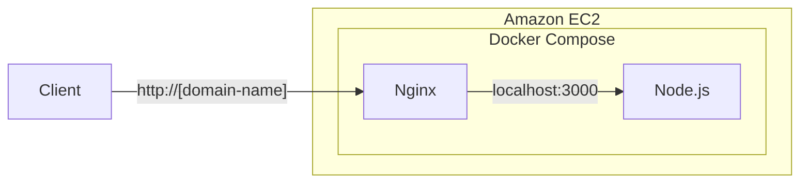

+++
title = "4. AWS: EC2, Network"
description = "클라우드 서비스 AWS의 기본적인 내용과 EC2, 네트워크 서비스를 배워봅니다."
icon = "article"
date = "2023-09-11"
lastmod = "2023-10-05"
weight = 340
+++

<!-- TODO: update `date` and `lastmod` -->

AWS(Amazon Web Services)는 클라우드 컴퓨팅 플랫폼으로, 현재 전세계에서 가장 많이 사용되고 있는 클라우드 서비스입니다. Microsoft Azure와 Google Cloud Platform과 함께 세계 3대 클라우드 서비스로 꼽히고 있어요. 이 중에서도 AWS는 가장 오래되었고, 가장 많은 사용자를 보유하고 있습니다. (TMI: FBI에서도 AWS를 사용한다고 해요!) 그래서 다른 서비스들도 AWS를 기준으로 지원하고 있고, AWS를 먼저 배우면 다른 클라우드 서비스도 배우기 쉬워요.

이번 시간부터 3주 간 AWS를 활용한 클라우드 서비스를 배워볼 거예요. 이번 시간에는 AWS의 가장 기본적인 서비스인 EC2를 배워보고, EC2를 사용하기 위한 AWS의 네트워크 서비스를 배워볼 거예요.

## 공부할 내용 📚

### 1. AWS

본격적으로 AWS를 사용해보기 전에 AWS란 무엇이고, 어떤 서비스들이 있는지 알아봅니다. 회원가입도 해보고 AWS를 살펴보면서 주의할 점들도 배워봅니다.

- AWS의 배경과 특징, 제공하는 서비스들을 알아봅니다.
- AWS에 회원가입을 하고, AWS Console에 로그인해봅니다.
- 해킹 예방을 위해 AWS 계정에 MFA(Multi-Factor Authentication)를 설정합니다.
- AWS free tier가 무엇인지 **간단하게** 알아봅니다.

#### 참고 자료

- **[44BITS "아마존 웹 서비스(AWS, Amazon Web Serivces)란?"](https://www.44bits.io/ko/keyword/amazon-web-service)**: AWS의 개요와 특징, 주요 서비스들을 설명합니다. 나열식으로 정리되어있어서 분량이 많은데, '이런 서비스가 있다!' 느낌으로 참고하세요. 차차 공부할 내용들이니, 전부 알 필요는 없어요.
- **[AWS Console](https://console.aws.amazon.com/console/home)**: AWS에 회원가입하고, AWS Console에 로그인해봅니다.
- **[아마존 웹 서비스 AWS 2단계 인증 활성화하는 방법](https://www.lainyzine.com/ko/article/how-to-enable-multi-factor-authentication-on-amazon-web-service/)**: AWS 계정에 MFA를 설정하는 방법을 설명합니다.





### 2. Amazon EC2

AWS의 가장 기본 서비스라고 할 수 있는 EC2를 사용해봅니다. EC2는 가상 머신을 대여해준다고 생각하면 됩니다. EC2를 사용하면 가상 머신을 빠르게 생성하고, 삭제하고, 관리할 수 있습니다.

- EC2의 개념과 특징을 알아봅니다. (instance type, 구매 옵션, life cycle)
- EC2 인스턴스를 생성하고 접속해봅니다. (t3.nano 추천)
- Security Group이 무엇인지 알아보고, SSH로 접속할 수 있도록 포트를 설정합니다.
- Instance Connect와 SSH로 EC2에 접속해봅니다. (두 방법 각각 해보세요!)
- Elastic IP가 무엇인지 알아봅니다. **(하나 할당만 무료입니다!)**

#### 참고 자료

- **["AWS EC2 개념 정리" (글)](https://velog.io/@server30sopt/AWS-EC2-%EA%B0%9C%EB%85%90-%EC%A0%95%EB%A6%AC)**: EC2의 다양한 개념들이 정리되어있습니다.
- **[생활코딩 "AWS - EC2 기본 사용법" (약 15분)](https://youtu.be/Pv2yDJ2NKQA?si=QaQlK6SNN_hZ03Cx)**: EC2를 세팅해보는 실습 영상입니다. 영상의 UI가 최신이 아니라서 실제 UI와 좀 다를 수 있지만 감안하면서 따라해보세요.
- **["EIP(탄력적 IP) 개념 & 사용 세팅 정리" (글)](https://inpa.tistory.com/entry/AWS-%F0%9F%93%9A-%ED%83%84%EB%A0%A5%EC%A0%81-IP-Elastic-IP-EIP-%EB%9E%80-%EB%AC%B4%EC%97%87%EC%9D%B8%EA%B0%80)**: Elastic IP의 개념과 사용 방법을 정리한 글입니다.



### 3. AWS Network

AWS에는 다양한 네트워크 설정이 있습니다. 너무 방대해서 내용을 모두 다루기는 어렵고, 기초적인 내용만 다루어봅니다.

- Region과 Availability Zone(가용 영역)이 무엇인지 알아봅니다.
- Amazon VPC 서비스의 개념과 subnet, route table, internet gateway에 대해 알아봅니다.

#### 참고 자료

- **[갓대희 "리전(지역)과 가용영역(Availability Zone)" (글)](https://goddaehee.tistory.com/178)**: AWS의 리전과 가용 영역의 개념과 use case를 설명한 글입니다.
- **[Inpa Dev "VPC 개념 & 사용" (글)](https://inpa.tistory.com/entry/AWS-%F0%9F%93%9A-VPC-%EC%82%AC%EC%9A%A9-%EC%84%9C%EB%B8%8C%EB%84%B7-%EC%9D%B8%ED%84%B0%EB%84%B7-%EA%B2%8C%EC%9D%B4%ED%8A%B8%EC%9B%A8%EC%9D%B4-NAT-%EB%B3%B4%EC%95%88%EA%B7%B8%EB%A3%B9-NACL-Bastion-Host)**: VPC와 subnet, routing table, internet gateway를 설명하고 직접 구성해봅니다.

#### 더 공부해보면 좋을 개념(선택)
VPC는 AWS에서 중요하면서도 꽤 어려운 내용이에요. 아래 영상에서 VPC를 잘 설명하고 있으니, 관심이 있다면 한 번 보세요. (약 46분)  
https://youtu.be/R1UWYQYTPKo?si=RzDLMDB2E2ulDJRi

## 프로젝트 실습 🎈

지난 주에 세팅했던 Docker container들을 EC2에 올려서 배포해볼 거예요! EC2에 Docker를 설치하고, Docker container를 구성한 다음, 휴대폰에서 EC2의 public IP로 접속해보세요. 예시는 [dotoleeoak.tech](http://dotoleeoak.tech)에서 확인할 수 있어요.



- Nginx container에서 listen하는 port를 80번(HTTP)으로 변경해주세요.
- Linux에 Docker를 설치할 때 아래 script를 이용하면 쉽게 설치할 수 있어요.

```sh
curl -fsSL https://get.docker.com | sudo sh -
```

- 설치 이후에 Docker를 사용하기 위해서는 root 권한이 필요합니다. root 권한 없이 Docker를 사용하려면 다음 링크를 참고해서 Docker 그룹에 현재 사용자를 추가해주세요. https://docs.docker.com/engine/install/linux-postinstall/
- Elastic IP로 고정 IP를 할당해보세요.
- [도메인 등록 가이드](../reference/Free%20Domain.md)에 따라 무료 도메인(.tech)를 발급받아 Elastic IP를 등록해보세요.



> **Challenge! 🔥 (선택)**  
> EC2를 VPC 내부에 구성하고, internet gateway로 외부와 통신할 수 있도록 설정해보세요.
