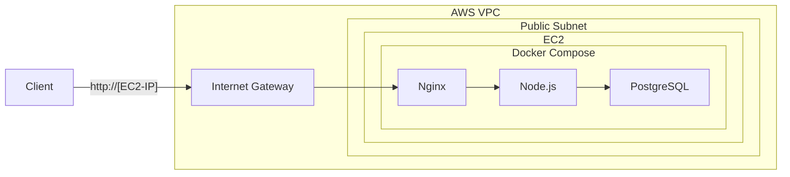

+++
title = "5. AWS: IAM, VPC, EC2"
description = "AWS의 기본 서비스인 IAM, VPC, EC2를 배우고 Docker 앱을 클라우드에 배포합니다."
icon = "article"
weight = 350
+++

AWS(Amazon Web Services)는 전 세계에서 가장 많이 사용되는 클라우드 플랫폼이에요. 이번 주부터 2주간 AWS를 배울 거예요.

이번 주에는 **IAM으로 보안 설정**을 하고, **VPC로 네트워크를 설계**한 뒤, **EC2 인스턴스에 Docker 앱을 배포**합니다. Session 2에서 배운 네트워크 개념이 AWS에서 어떻게 적용되는지 직접 확인하게 될 거예요.



## 사전 준비 ⚙️

- **AWS 계정 생성:** https://console.aws.amazon.com/ 에서 Free Tier 계정을 만드세요.
- **MFA 설정:** Root 계정에 반드시 MFA(Multi-Factor Authentication)를 설정하세요.
- **Billing Alarm 설정:** $5 이상 과금 시 알림을 받도록 설정하세요.
- **AWS CLI 설치:** https://docs.aws.amazon.com/ko_kr/cli/latest/userguide/getting-started-install.html

## 공부할 내용 📚

### 1. IAM — 가장 먼저 배워야 할 것

IAM(Identity and Access Management)은 AWS에서 **누가 무엇을 할 수 있는지** 관리하는 서비스예요. EC2보다 먼저 배우는 이유: IAM을 모르면 모든 것을 root 계정으로 하게 되고, 그건 보안 사고의 시작이에요.

#### 핵심 개념

- **Root 계정:** 모든 권한을 가진 최고 관리자. MFA 걸고 잠가두세요. 일상적으로 쓰면 안 돼요.
- **IAM User:** 이름이 있는 계정. 각 사람마다 하나씩 만들어요.
- **IAM Policy:** "이 리소스에서 이 작업을 허용/거부한다"는 JSON 규칙.
- **IAM Role:** **서비스가 사용하는 권한.** 예: EC2 인스턴스가 S3에 접근해야 할 때 Role을 부여. 사람이 아니라 서비스가 "일시적으로 맡는(Assume)" 권한이에요.
- **최소 권한 원칙:** 필요한 권한만 부여. 학습 중에는 AdministratorAccess를 쓰되, 프로덕션에서는 절대 안 돼요.

#### IAM Policy JSON 구조

```json
{
  "Version": "2012-10-17",
  "Statement": [
    {
      "Effect": "Allow",
      "Action": ["ec2:Describe*", "ec2:StartInstances", "ec2:StopInstances"],
      "Resource": "*"
    }
  ]
}
```

**실습: IAM User 만들기**

1. AWS Console → IAM → Users → Create User
2. 이름 지정, Console 로그인 활성화
3. `AdministratorAccess` 정책 연결 (학습용)
4. Access Key 생성 (CLI 용도)
5. `aws configure`로 Access Key 등록



#### 참고 자료

- **["IAM이란 (정책, 역할, 권한 경계)" (글)](https://yoonchang.tistory.com/93)**: IAM의 개념들이 정리되어있습니다.

### 2. VPC — 네트워크 설계

VPC(Virtual Private Cloud)는 AWS 안에서 **나만의 격리된 네트워크**예요. Session 2에서 배운 IP, 서브넷, NAT, 방화벽이 여기서 그대로 적용됩니다.

#### 아키텍처

아래 구조를 직접 만들어볼 거예요:

```
VPC: 10.0.0.0/16
│
├── Public Subnet A:  10.0.1.0/24  (ap-northeast-2a)
│    └── EC2 인스턴스 (Docker 앱)
├── Public Subnet B:  10.0.2.0/24  (ap-northeast-2b)
│    └── (비어있음, 고가용성용)
│
├── Private Subnet A: 10.0.10.0/24 (ap-northeast-2a)
├── Private Subnet B: 10.0.11.0/24 (ap-northeast-2b)
│
├── Internet Gateway (IGW)
│    └── Public Subnet의 Route Table: 0.0.0.0/0 → IGW
│
└── Security Groups
     ├── web-sg: 인바운드 80(HTTP), 22(SSH from 내 IP)
     └── (나중에 db-sg 추가)
```

#### 핵심 개념 연결 (Session 2 복습)

| Session 2 개념 | AWS에서 대응하는 것 |
|---------------|------------------|
| CIDR / 서브넷 | VPC CIDR + Subnet |
| Public vs Private IP | Public Subnet (IGW 연결) vs Private Subnet |
| NAT | NAT Gateway (Private → 인터넷 나가기) |
| 방화벽 (Stateful) | Security Group |
| 방화벽 (Stateless) | Network ACL (NACL) |
| 라우팅 테이블 | Route Table |

- **Availability Zone (AZ):** 물리적으로 분리된 데이터센터. 최소 2개 AZ에 서브넷을 두는 게 기본이에요.
- **Public Subnet:** Route Table에 `0.0.0.0/0 → Internet Gateway` 경로가 있는 서브넷.
- **Private Subnet:** IGW 경로가 없는 서브넷. 인터넷에서 직접 접근 불가.

#### 참고 자료

- **[Inpa Dev "VPC 개념 & 사용" (글)](https://inpa.tistory.com/entry/AWS-%F0%9F%93%9A-VPC-%EC%82%AC%EC%9A%A9-%EC%84%9C%EB%B8%8C%EB%84%B7-%EC%9D%B8%ED%84%B0%EB%84%B7-%EA%B2%8C%EC%9D%B4%ED%8A%B8%EC%9B%A8%EC%9D%B4-NAT-%EB%B3%B4%EC%95%88%EA%B7%B8%EB%A3%B9-NACL-Bastion-Host)**: VPC, Subnet, IGW, NAT, Security Group을 실습과 함께 설명합니다.
- **[VPC 상세 설명 영상 (약 46분)](https://youtu.be/R1UWYQYTPKo?si=RzDLMDB2E2ulDJRi)**: VPC를 깊이 이해하고 싶다면 추천합니다.

### 3. EC2 — 서버 인스턴스

EC2(Elastic Compute Cloud)는 가상 서버를 대여하는 서비스예요.

- **Instance Type:** `t3.micro` (Free Tier). vCPU, 메모리 조합.
- **AMI (Amazon Machine Image):** OS 이미지. Amazon Linux 2023 또는 Ubuntu 22.04 사용.
- **Key Pair:** SSH 접속용 키. 분실하면 인스턴스에 접속 불가!
- **Elastic IP:** 고정 공인 IP. 인스턴스를 중지/시작해도 IP가 변하지 않음.



#### 참고 자료

- **[생활코딩 "AWS - EC2 기본 사용법" (약 15분)](https://youtu.be/Pv2yDJ2NKQA?si=QaQlK6SNN_hZ03Cx)**: EC2 실습 영상입니다. UI가 최신은 아니지만 흐름은 동일해요.
- **["EIP(탄력적 IP) 개념 & 사용 세팅 정리" (글)](https://inpa.tistory.com/entry/AWS-%F0%9F%93%9A-%ED%83%84%EB%A0%A5%EC%A0%81-IP-Elastic-IP-EIP-%EB%9E%80-%EB%AC%B4%EC%97%87%EC%9D%B8%EA%B0%80)**: Elastic IP에 대해 알아보세요. **(과금 정책 반드시 확인!)**

---

## 프로젝트 실습 🎈

### Step 1: VPC 구성

AWS Console에서 위에 설명한 VPC 아키텍처를 직접 만드세요.

1. VPC 생성 (10.0.0.0/16)
2. Subnet 4개 생성 (Public 2개 + Private 2개, AZ 분리)
3. Internet Gateway 생성 및 VPC에 연결
4. Route Table 생성: Public 서브넷용 (0.0.0.0/0 → IGW)
5. Route Table을 Public 서브넷에 연결



### Step 2: EC2 인스턴스 생성

1. AMI: Ubuntu 22.04 LTS 선택
2. Instance Type: `t3.micro`
3. 네트워크: 위에서 만든 VPC의 **Public Subnet A** 선택
4. Public IP 자동 할당: 활성화
5. Security Group (`web-sg`):
   - 인바운드: SSH(22) from **내 IP만**, HTTP(80) from 0.0.0.0/0
   - 아웃바운드: 전체 허용
6. Key Pair 생성 및 다운로드

### Step 3: EC2에 Docker 앱 배포

```bash
# SSH 접속
ssh -i key.pem ubuntu@<EC2-Public-IP>

# Docker 설치
curl -fsSL https://get.docker.com | sudo sh -
sudo usermod -aG docker ubuntu
# 재접속

# 앱 배포 (git clone 또는 docker-compose.yml 직접 작성)
git clone <your-repo>
cd todo-app
docker compose up -d

# 확인
curl http://localhost/api/todos
```

### Step 4: 외부에서 접속 확인

브라우저나 로컬에서:

```bash
curl http://<EC2-Public-IP>/api/todos
```



### Step 5: Elastic IP 연결

1. EC2 > Elastic IPs > Allocate
2. Actions > Associate > EC2 인스턴스 선택
3. 이제 고정 IP로 접속 가능



### 실험해보기 🔬

1. **Security Group 실험:** 80번 포트 인바운드 규칙을 삭제하고 접속해보세요. → timeout. 다시 추가하면 바로 접속 됨. **AWS에서 "접속이 안 돼요"의 90%는 Security Group 문제예요.**
2. **SSH에 잘못된 키 사용:** 다른 key pair로 접속 시도하면? `Permission denied`.
3. **인스턴스 중지/시작:** EIP 없이 중지 후 시작하면 Public IP가 바뀌는 것을 확인하세요.

> **Challenge! 🔥 (선택)**
> Private Subnet에 EC2 인스턴스를 만들고, NAT Gateway를 통해 인터넷에 접속할 수 있도록 설정해보세요. (비용 주의: NAT Gateway는 시간당 과금!)
