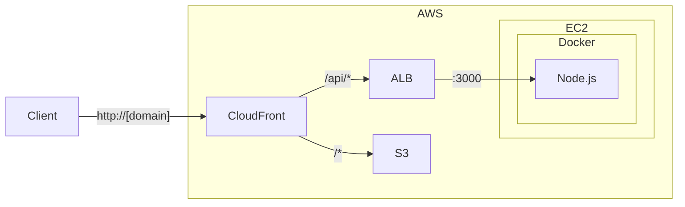

+++
title = "5. AWS: S3, CloudFront, ALB"
description = "S3로 정적 파일을 호스팅하고, CloudFront와 ALB로 프로덕션에 가까운 아키텍처를 만듭니다."
icon = "article"
weight = 350
+++

지난 주에 EC2에 Docker 앱을 배포했어요. 이번 주에는 AWS의 추가 서비스들을 활용해서 **프로덕션에 가까운 아키텍처**를 만들어볼 거예요.

Session 3에서 Nginx가 하던 일들을 AWS의 매니지드 서비스들이 대신해줍니다:

| Nginx의 역할 | AWS 대체 서비스 |
|-------------|---------------|
| 정적 파일 서빙 | **S3 + CloudFront** |
| 리버스 프록시 / 로드 밸런싱 | **ALB** |

직접 Nginx를 운영하면 설정, 업데이트, 장애 대응을 다 해야 하지만, 매니지드 서비스는 AWS가 관리해줘요. 왜 그 방식이 더 나은지도 생각해보세요.

## 공부할 내용

### 1. Amazon S3

S3는 파일(오브젝트) 스토리지예요. 이번 주에는 **Static Website Hosting** 기능에 집중하세요.

알아야 할 것:
- Bucket과 Object의 관계
- S3가 기본적으로 모든 것을 Private으로 두는 이유
- Bucket Policy로 접근 제어하는 법

#### 참고 자료

- **[AWS "Amazon S3란?"](https://docs.aws.amazon.com/AmazonS3/latest/userguide/Welcome.html)**: S3의 핵심 개념(버킷, 오브젝트, 스토리지 클래스)을 설명하는 공식 문서입니다.
- **[AWS "S3 정적 웹사이트 호스팅"](https://docs.aws.amazon.com/AmazonS3/latest/userguide/WebsiteHosting.html)**: Static Website Hosting 설정 방법을 설명하는 공식 문서입니다.
- **[Amazon S3 요금](https://aws.amazon.com/ko/s3/pricing/)**: 요금 구조를 미리 확인하세요.

### 2. Amazon CloudFront

CloudFront는 CDN 서비스예요.

알아야 할 것:
- CDN이 왜 필요한지 (Origin 서버에서 직접 서빙하면 뭐가 문제인지)
- Origin, Distribution, TTL, Invalidation 개념
- **Path pattern으로 요청을 다른 Origin으로 라우팅하는 법** — 이번 실습의 핵심!

#### 참고 자료

- **[AWS "Amazon CloudFront란?"](https://docs.aws.amazon.com/AmazonCloudFront/latest/DeveloperGuide/Introduction.html)**: CloudFront의 동작 원리(Distribution, Edge Location, Origin)를 설명하는 공식 문서입니다.
- **[Cloudflare "CDN이란?"](https://www.cloudflare.com/learning/cdn/what-is-a-cdn/)**: CDN의 일반적인 개념과 왜 필요한지를 설명합니다.

### 3. ALB (Application Load Balancer)

Session 3에서 Nginx가 리버스 프록시 역할을 했어요. ALB는 AWS가 관리해주는 L7 로드밸런서입니다. 직접 Nginx를 운영하는 것 대비 뭐가 좋은지 생각해보세요.

알아야 할 것:
- Target Group과 Health Check의 관계 — Session 1에서 만든 `/health` endpoint가 여기서 쓰여요!
- Listener 규칙
- ALB를 사용하려면 **최소 2개 AZ**가 필요한 이유

#### 참고 자료

- **[AWS "Application Load Balancer란?"](https://docs.aws.amazon.com/elasticloadbalancing/latest/application/introduction.html)**: ALB의 L7 라우팅, Target Group, Health Check를 설명하는 공식 문서입니다.

---

## 프로젝트 실습

아래 아키텍처를 구성하세요.



### Step 1: S3 정적 웹사이트 호스팅

S3 버킷을 만들고, 정적 웹 페이지를 호스팅하세요.

**요구사항:**
- Static Website Hosting을 활성화할 것
- 버킷의 오브젝트를 퍼블릭으로 읽을 수 있도록 Bucket Policy를 설정할 것 (AWS 문서에서 Policy JSON 형식을 찾아보세요)
- S3 웹사이트 URL로 접속해서 페이지가 뜨는 것을 확인할 것



### Step 2: EC2 Docker 앱 수정

Session 4의 EC2에서 **Nginx 컨테이너를 제거**하세요. ALB가 그 역할을 대신합니다.

**요구사항:**
- Node.js 컨테이너의 포트 3000만 외부에 노출
- Security Group에서 3000번 포트 열기
- `http://[EC2-IP]:3000/`, `http://[EC2-IP]:3000/api/info`, `http://[EC2-IP]:3000/health`로 직접 접속 확인

### Step 3: ALB 설정

EC2 앞에 ALB를 배치하세요.

**요구사항:**
- Target Group: HTTP, 포트 3000, Health check path `/health`
- ALB: Internet-facing, HTTP:80 리스너, 최소 2개 AZ 매핑
- ALB의 DNS name으로 접속해서 API 동작 확인

```bash
curl http://[ALB-DNS-name]/
curl http://[ALB-DNS-name]/api/info
curl http://[ALB-DNS-name]/health
```



### Step 4: CloudFront 설정

CloudFront Distribution을 만들어 S3와 ALB를 하나로 묶으세요.

**요구사항:**
- Origin 2개: S3 (정적 파일)와 ALB (API)
- 기본 경로(`/*`)는 S3로, `/api/*` 경로는 ALB로 라우팅
- Session 1에서 만든 `/api/info` 라우트가 CloudFront → ALB를 통해 그대로 동작하는지 확인 (`/health`는 ALB Health Check용으로 CloudFront를 거치지 않아도 돼요)

```bash
# 정적 페이지 (S3에서 서빙)
curl http://[CloudFront-Domain]/

# API (ALB -> EC2 -> Node.js에서 처리)
curl http://[CloudFront-Domain]/api/info
```



### (선택) 도메인 연결

[무료 도메인 등록 가이드](./Free%20Domain.md)를 참고해서 도메인을 발급받고, CloudFront에 연결해보세요.



### 실험해보기

1. **Health Check 실패:** EC2에서 앱을 종료해보세요. ALB Target Group에서 "unhealthy"로 표시되는 걸 확인하세요. 다시 앱을 띄우면 얼마 후에 "healthy"로 돌아오나요? 그 시간은 어디서 결정되나요?

2. **CloudFront 캐싱:** S3의 HTML 파일을 수정하고 새로 업로드하세요. CloudFront에서 바로 반영되나요? 안 된다면 왜? 직접 해결해보세요.

3. **ALB 없이 직접 접속:** EC2의 Security Group에서 3000번 포트의 인바운드 Source를 **ALB의 Security Group**으로 제한해보세요. 외부에서 EC2:3000에 직접 접속은 막히지만, ALB를 통한 접속은 되나요? (힌트: Security Group의 Source를 IP 대신 다른 Security Group으로 지정할 수 있어요.)

> **Challenge (선택)**
> ACM(AWS Certificate Manager)으로 SSL 인증서를 발급받아서 HTTPS를 설정해보세요. CloudFront에 인증서를 연결하면 됩니다.
