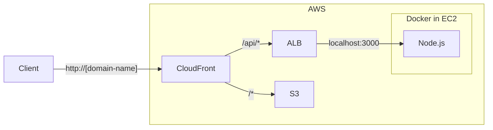

+++
title = "5. AWS: S3, IAM"
description = "AWS의 S3와 IAM에 대해 알아봅니다."
icon = "article"
date = "2023-10-26"
lastmod = "2023-10-26"
weight = 350
+++

Amazon S3는 AWS에서 제공하는 파일 스토리지 서비스입니다. 작게는 HTML, CSS 같은 웹 사이트 정적 파일을 저장하고, 크게는 수십 테라바이트의 데이터를 저장할 수 있어요.

IAM은 AWS의 Identity and Access Management의 약자로, AWS의 사용자, 그룹, 권한을 관리하는 서비스입니다. 보안 뿐만 아니라 프로그램의 예상치 못한 동작을 방지하기 위해 IAM을 사용해요.

## 공부할 내용 📚

### 1. Amazon S3

Amazon S3의 기본적인 용어들을 알아보고, S3 버킷을 생성하며 관련 설정들을 알아봐요.

- S3의 개념과 특징을 알아봐요.
- S3의 용어들을 알아봐요. (bucket, object, key, ACL)
- S3 버킷을 생성하고, 버킷에 파일을 업로드해봐요.
- S3의 요금을 알아봐요.
- S3의 버저닝 기능을 알아봐요.

#### 참고 자료

- **["AWS Amazon S3 버킷 생성하기" (글)](https://zzang9ha.tistory.com/358)**: S3의 다양한 개념들이 정리되어있습니다.
- **["Amazon S3 요금"](https://aws.amazon.com/ko/s3/pricing/)**: AWS의 S3 요금 페이지입니다. S3의 요금을 알아보세요.
- **["S3 버킷에서 버전 관리를 사용하면 무엇이 달라질까?" (글)](https://dev.classmethod.jp/articles/jw-what-would-it-make-a-difference-to-use-version-management-in-an-s3-bucket/)**: S3의 버전 관리 기능에 대해 알아보세요.

### 2. Amazon CloudFront

Amazon CloudFront는 AWS에서 제공하는 CDN(Content Delivery Network) 서비스입니다. CDN은 전 세계에 분산된 서버를 통해 정적 파일을 빠르게 전송할 수 있도록 도와줍니다.

- CloudFront의 개념과 특징을 알아봐요.
- CloudFront의 용어들을 알아봐요. (distribution, origin, TTL, invalidation)
- CloudFront의 요금을 알아봐요.

#### 참고 자료

- **["CloudFront" (글))](https://velog.io/@combi_areum/AWS-CloudFront)**: Cloudfront 개념과 특징을 정리한 글입니다.
- **["CloudFront 요금"](https://aws.amazon.com/ko/cloudfront/pricing/)**: AWS의 CloudFront 요금 페이지입니다. CloudFront의 요금을 알아보세요.

### 3. AWS IAM

AWS IAM의 용어들과 구성, 문법을 알아봐요.

- IAM의 용어들을 알아봐요. (User, Group, Role, Policy, Permission)
- User를 새로 생성하고, 직접 로그인해봐요.
- IAM Policy의 JSON 문법을 알아봐요. (Statement, Effect, Action, Resource)
- Identity-based Policy와 Resource-based Policy의 차이를 알아봐요.



#### 참고 자료

- **["IAM이란 (정책, 역할, 권한 경계)" (글)](https://yoonchang.tistory.com/93)**: IAM의 다양한 개념들이 정리되어있습니다.
- **["AWS IAM Identity base 와 resource base policy 의 차이" (글)](https://going-to-end.tistory.com/entry/AWS-IAM-Policy%EC%A0%95%EC%B1%85-Role%EC%97%AD%ED%95%A0-%EC%97%90-%EB%8C%80%ED%95%B4-%EC%95%8C%EC%95%84%EB%B3%B4%EC%9E%90)**

## 프로젝트 실습 🎈

이번 주에는 아래 그림처럼 클라우드 서비스를 구성해봐요. Client의 요청은 CloudFront로 전달되고, `/api` 요청은 EC2의 Node.js로, 그 외 요청은 S3로 전달됩니다. ALB는 AWS의 Load Balancer 서비스로, 스터디에 없었던 내용인 만큼 세팅 방법은 아래를 참고해주세요. 실습 내용이 많은 만큼, 힌트를 많이 드릴게요!



- S3에 HTML, CSS, JS 파일을 업로드하세요. (파일 링크:
<a href="/docs/infra/assets/week5/index.html" download>HTML</a>,
<a href="/docs/infra/assets/week5/style.css" download>CSS</a>,
<a href="/docs/infra/assets/week5/script.js" download>JS</a>)

- S3에서 Static Website Hosting을 설정하고, Permisson을 public으로 바꾼 다음 접속이 잘 되는지 확인하세요. Permission은 아래 순서로 바꿀 수 있어요.

  1. Bucket 선택 > Permissions 탭 > Block public access 편집 > ACL 들어간 항목 제외한 두 가지 모두 체크 해제 ('Save changes'가 안된다면, 왼쪽 탭에서 'Block Public Access settings for this account' 클릭 후 마찬가지로 체크 해제)
  2. Bucket Policy 편집 > 아래 JSON을 붙여넣기 > `YOUR_BUCKET_NAME`을 자신의 버킷 이름으로 바꾸기

```json
{
  "Version": "2012-10-17",
  "Statement": [
      {
          "Sid": "PublicReadGetObject",
          "Effect": "Allow",
          "Principal": "*",
          "Action": "s3:GetObject",
          "Resource": "arn:aws:s3:::YOUR_BUCKET_NAME/*"
      }
  ]
}
```

- CloudFront를 생성하고, S3를 origin으로 설정하세요. 이후 CloudFront의 Domain Name으로 접속이 잘 되는지 확인하세요.

- EC2에 기존의 Node.js Docker Container를 올리세요. Nginx 컨테이너는 사용하지 않습니다. docker-compose.yml 파일에서 Nginx 컨테이너를 제거하고, Node.js 컨테이너의 포트 3000을 열어주세요.

```yml
version: '3'

services:
  nodejs:
    container_name: nodejs
    build:
      context: .
      dockerfile: Dockerfile
    # 또는 `image: <owner>/<image>:<tag>`
    ports:
      - 3000:3000
```

- EC2의 3000번 포트를 Security Group으로 열어두세요. 직접 URL을 입력해서 접속이 잘 되는지 확인하세요. (예: `http://123.456.789.123:3000/api/os`)

- ALB를 생성하기 전, Target Group을 생성하세요.

  1. 왼쪽 탭의 'Target Groups'를 클릭하세요.
  2. 'Create target group'을 클릭하세요.
  3. Target type은 'Instances'를 선택하고, Target Group Name을 설정하세요. 나머지는 기본값으로 두고, Next를 클릭하세요.
  4. 실행 중인 EC2 인스턴스를 선택하고, 포트 번호는 3000으로 설정하세요. 'Include as pending below'를 클릭하고, 'Create target group'을 클릭하세요.

- EC2 화면에서 왼쪽 탭의 'Load Balancers'를 클릭하여 ALB를 생성하세요.

  1. 세 가지 옵션 중 'Application Load Balancer'를 선택하세요.
  2. Scheme은 'Internet-facing'으로 설정하세요.
  3. 'Mapping' 중 'Availability Zones'에서 최소 두 개의 Availability Zone을 선택하세요. **Target Group의 Availability Zone을 포함해야합니다.**
  4. 나머지는 그대로 두고, "Listeners and routing"에서 HTTP:80에 target group을 이전 단계에서 생성한 target group을 선택하세요.
  5. 'Create load balancer'를 클릭하세요.
  6. Load balancer를 선택하고, Security 탭에서 Security Group을 수정하세요. Inbound 규칙에 HTTP:80을 추가하세요.
  6. Load balancer의 정보 중 'DNS name'을 찾아 api 요청(예: `/api/os`)이 잘 되는지 확인하세요. 구성되는 데 시간이 걸릴 수 있어요. (**잊지 말고 http:// 붙여서 요청하세요!**)

- CloudFront에서 ALB를 origin으로 설정하세요. `/api/*` 요청은 ALB로, 그 외 요청은 S3로 전달되도록 설정하세요. 이후 CloudFront의 Domain Name으로 접속이 잘 되는지 확인하세요.
