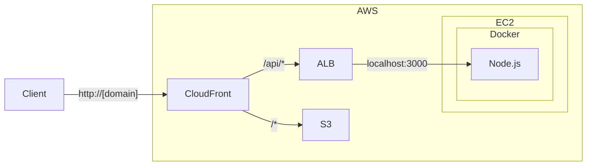

+++
title = "6. AWS: S3, CloudFront, ALB"
description = "S3로 정적 파일을 호스팅하고, CloudFront와 ALB로 프로덕션에 가까운 아키텍처를 만듭니다."
icon = "article"
weight = 360
+++

지난 주에 EC2에 Docker 앱을 배포했어요. 이번 주에는 AWS의 추가 서비스들을 활용해서 **프로덕션에 가까운 아키텍처**를 만들어볼 거예요.

- **S3:** 정적 파일(HTML, CSS, JS) 호스팅
- **CloudFront:** CDN으로 전 세계에 빠르게 콘텐츠 전달
- **ALB:** Application Load Balancer로 EC2 앞에 로드밸런서 배치

## 공부할 내용 📚

### 1. Amazon S3

S3(Simple Storage Service)는 **파일(오브젝트) 스토리지** 서비스예요.

- **Bucket:** 파일을 담는 최상위 컨테이너 (전 세계에서 유일한 이름)
- **Object:** 버킷 안의 파일. Key(경로) + Value(파일 내용)으로 구성.
- **Static Website Hosting:** S3 버킷을 웹 서버처럼 사용할 수 있어요.
- **접근 제어:** 기본적으로 모든 것이 Private. Bucket Policy로 공개 설정.

#### 참고 자료

- **["AWS Amazon S3 버킷 생성하기" (글)](https://zzang9ha.tistory.com/358)**: S3의 개념과 버킷 생성을 정리한 글입니다.
- **[Amazon S3 요금](https://aws.amazon.com/ko/s3/pricing/)**: S3의 요금 구조를 확인하세요.
- **[S3 버전 관리 (글)](https://dev.classmethod.jp/articles/jw-what-would-it-make-a-difference-to-use-version-management-in-an-s3-bucket/)**: S3의 버전 관리 기능에 대해 알아보세요.

### 2. Amazon CloudFront

CloudFront는 **CDN(Content Delivery Network)** 서비스예요. 전 세계에 분산된 Edge Location에서 콘텐츠를 캐싱하여 사용자에게 빠르게 전달합니다.

- **Distribution:** CloudFront 배포 단위
- **Origin:** 원본 콘텐츠가 있는 곳 (S3, ALB, EC2 등)
- **TTL:** 캐시 유지 시간
- **Invalidation:** 캐시를 강제로 갱신

#### 참고 자료

- **["CloudFront" (글)](https://velog.io/@combi_areum/AWS-CloudFront)**: CloudFront 개념을 정리한 글입니다.

### 3. ALB (Application Load Balancer)

ALB는 **L7(HTTP/HTTPS) 로드밸런서**예요. Session 4에서 Nginx가 하던 역할을 AWS가 관리해주는 서비스라고 생각하면 돼요.

- **Target Group:** ALB가 트래픽을 전달할 대상 (EC2 인스턴스들)
- **Listener:** 어떤 포트/프로토콜로 요청을 받을지 설정
- **Health Check:** Target의 상태를 주기적으로 확인. Session 3에서 만든 `/health` endpoint가 여기서 쓰여요!
- **Path-based Routing:** 경로에 따라 다른 Target Group으로 분배 가능

---

## 프로젝트 실습 🎈

아래 아키텍처를 구성해볼 거예요.



### Step 1: S3 정적 웹사이트 호스팅

1. S3 버킷 생성 (이름은 고유해야 해요)
2. HTML, CSS, JS 파일 업로드 (간단한 프론트엔드 페이지)
3. Static Website Hosting 활성화 (Properties > Static website hosting)
4. Public Access 설정:
   - Block Public Access 해제
   - Bucket Policy 추가:

```json
{
  "Version": "2012-10-17",
  "Statement": [
    {
      "Sid": "PublicReadGetObject",
      "Effect": "Allow",
      "Principal": "*",
      "Action": "s3:GetObject",
      "Resource": "arn:aws:s3:::YOUR_BUCKET_NAME/*"
    }
  ]
}
```

5. S3 웹사이트 URL로 접속해서 확인하세요.

### Step 2: EC2 Docker 앱 수정

- Session 5의 EC2에서 Nginx 컨테이너를 제거하세요. ALB가 그 역할을 대신합니다.
- Node.js 컨테이너의 포트 3000을 외부에 노출하세요.

```yaml
services:
  app:
    build: .
    ports:
      - "3000:3000"
    environment:
      DATABASE_URL: postgres://todo:secret@db:5432/tododb
    depends_on:
      db:
        condition: service_healthy

  db:
    image: postgres:16-alpine
    environment:
      POSTGRES_USER: todo
      POSTGRES_PASSWORD: secret
      POSTGRES_DB: tododb
    volumes:
      - pgdata:/var/lib/postgresql/data
    healthcheck:
      test: ["CMD-SHELL", "pg_isready -U todo"]
      interval: 5s
      timeout: 3s
      retries: 5

volumes:
  pgdata:
```

- Security Group에서 3000번 포트를 열어두세요.
- `http://[EC2-IP]:3000/api/todos`로 직접 접속이 되는지 확인하세요.

### Step 3: ALB 설정

#### Target Group 생성

1. EC2 > Target Groups > Create Target Group
2. Target type: Instances
3. Protocol: HTTP, Port: 3000
4. Health check path: `/health`
5. EC2 인스턴스를 타겟으로 등록

#### ALB 생성

1. EC2 > Load Balancers > Create > Application Load Balancer
2. Scheme: Internet-facing
3. **Mapping: 최소 2개 AZ 선택** (Target Group이 있는 AZ 포함!)
4. Listener: HTTP:80 → 위에서 만든 Target Group
5. Security Group: HTTP(80) 인바운드 허용

생성 후 ALB의 **DNS name**으로 접속해서 API가 잘 동작하는지 확인하세요.

```bash
curl http://[ALB-DNS-name]/api/todos
curl http://[ALB-DNS-name]/health
```



### Step 4: CloudFront 설정

1. CloudFront > Create Distribution
2. **Origin 1 (S3):** S3 버킷의 website endpoint를 origin으로 설정
3. **Origin 2 (ALB):** ALB의 DNS name을 origin으로 설정 (HTTP only)
4. **Default Cache Behavior:** S3 origin (정적 파일)
5. **Additional Cache Behavior:** Path pattern `/api/*` → ALB origin

CloudFront의 Domain Name으로 접속해서 모든 것이 잘 동작하는지 확인하세요:

```bash
# 정적 페이지 (S3에서 서빙)
curl http://[CloudFront-Domain]/

# API (ALB → EC2 → Node.js에서 처리)
curl http://[CloudFront-Domain]/api/todos
```

### (선택) 도메인 연결

[무료 도메인 등록 가이드](./Free%20Domain.md)를 참고해서 도메인을 발급받고, CloudFront에 연결해보세요.



### 실험해보기 🔬

1. **Health Check 실패:** EC2에서 앱을 종료해보세요. ALB Target Group에서 "unhealthy"로 표시되는 것을 확인하세요.
2. **CloudFront 캐싱:** S3의 HTML 파일을 수정하고 새로 업로드하세요. CloudFront에서는 바로 반영 안 될 수 있어요. Invalidation을 만들어서 캐시를 갱신해보세요.

> **Challenge! 🔥 (선택)**
> ACM(AWS Certificate Manager)으로 SSL 인증서를 발급받아서 HTTPS를 설정해보세요. CloudFront에 인증서를 연결하면 됩니다.
