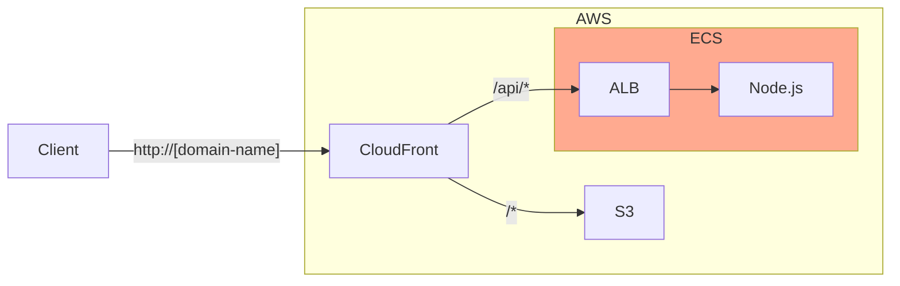

+++
title = "6. AWS: ECS"
description = "AWS의 컨테이너 관리 서비스인 ECS에 대해 알아봅니다."
icon = "article"
date = "2023-10-30"
lastmod = "2023-10-30"
weight = 360
+++

Amazon ECS는 AWS에서 제공하는 컨테이너 관리 서비스입니다. 쿠버네티스와 비슷하지만, 조금 더 쉽게 사용할 수 있어요.

이번 시간에는 스꾸딩 인프라 팀의 꽃이라고 할 수 있는 ECS에 대해 알아보겠습니다.

## 공부할 내용 📚

### 1. ELB

ELB는 AWS의 Load Balancer 서비스로, EC2와 함께 AWS에서 많이 사용됩니다. ELB로 요청을 분산시키고, EC2 개수를 늘리면서 서버의 확장성을 높일 수 있습니다.

- Load Balancer의 주요 기능을 알아봐요. (Load Balancing, High Availability, Fault Tolerance)
- ELB의 종류를 알아봐요. (Application Load Balancer, Network Load Balancer, Classic Load Balancer)
- ELB의 요금을 알아봐요.
- ELB의 주요 설정을 알아봐요. (Listener, Target Group, Health Check)

#### 참고 자료

- **["AWS ELB 쉽게 이해하기 #1"](https://aws-hyoh.tistory.com/128)**: ELB의 기본 개념을 정리해놓은 글입니다.
- **[Elastic Load Balancing 요금](https://aws.amazon.com/ko/elasticloadbalancing/pricing/)**: ELB의 요금을 확인할 수 있습니다.

### 2. Amazon ECR

Amazon ECR은 AWS에서 제공하는 Docker Registry 서비스로, Docker 이미지를 저장하고, 관리할 수 있습니다. AWS에서 컨테이너를 사용할 때는 ECR을 사용하는 것이 일반적이예요.

- ECR이 어떤 서비스인지, 어떤 기능을 제공하는지 알아봐요.
- 다른 저장소 대신 ECR을 사용하는 이유를 알아봐요.

#### 참고 자료

- **["ECR이란?"](https://ks1171-park.tistory.com/107)**: ECR의 기본 개념을 정리해놓은 글입니다.

### 3. Amazon ECS

Amazon ECS는 AWS에서 제공하는 컨테이너 오케스트레이션 서비스로, 컨테이너를 쉽게 관리할 수 있도록 도와줍니다.

- ECS의 기본 개념을 알아봐요.
- ECS의 용어들과 구성을 알아봐요. (Cluster, Task Definition, Task, Service)
- ECS의 실행 모델을 알아봐요. (Fargate, EC2)
- ECS의 요금을 알아봐요.

#### 참고 자료

- **["AWS ECS 살펴보기"](https://boostbrothers.github.io/technology/2020/01/29/AWS-ECS-%EC%82%B4%ED%8E%B4%EB%B3%B4%EA%B8%B0/)**: ECS의 기본 개념을 정리해놓은 글입니다.
- **["ECS vs EKS, EC2 vs Fargate 배포 서비스 비교해보기"](https://velog.io/@tanggu01/%EB%B0%8D%EA%B8%80-ECS-vs-EKS-EC2-vs-Fargate-%EB%B0%B0%ED%8F%AC-%EC%84%9C%EB%B9%84%EC%8A%A4-%EB%B9%84%EA%B5%90%ED%95%B4%EB%B3%B4%EA%B8%B0)**: ECS의 EC2와 Fargate를 비교해봅니다.
- **["AWS ECS 요금"](https://aws.amazon.com/ko/ecs/pricing/)**: ECS의 요금을 확인할 수 있습니다.

## 프로젝트 실습 🎈

이번 주에는 Node.js 컨테이너를 ECS로 구성해봐요. 아래 그림처럼 지난 주에 EC2로 ALB와 EC2로 구성한 부분을 ECS로 대체할 거예요.



### AWS CLI를 설치하세요.

1. [공식 가이드](https://docs.aws.amazon.com/ko_kr/cli/latest/userguide/getting-started-install.html)를 참고해 설치하세요.
2. 설치가 완료되면, `aws --version` 명령어를 실행해 설치가 잘 되었는지 확인하세요.
3. Management Console에서 IAM User를 생성하세요. (`AmazonEC2ContainerRegistryFullAccess` 권한 필요)
4. 생성된 IAM User의 "Security Credentials" 탭에서 access key를 생성하세요. (CLI 모드)
5. 터미널에서 `aws configure` 명령어를 실행해 access key를 등록하세요.

### Amazon ECR에 Node.js 이미지를 저장해요.

1. ECR Repository를 생성하세요. (Private 권장!)
2. 로컬에서 Node.js 이미지를 만드세요. (`docker build -t [repository-url] .`)
3. 아래 명령어로 ECR에 로그인하세요. ([region], [aws_account_id]는 수정해주세요!)
  ```bash
  aws ecr get-login-password --region [region] | docker login --username AWS --password-stdin [aws_account_id].dkr.ecr.[region].amazonaws.com
  ```
4. 이미지를 ECR에 업로드하세요. (`docker push [repository-url]`)
5. ECR에서 이미지를 확인하세요.



### Amazon ECS Cluster를 생성하세요.

EC2 Launch Type과 Fargate Launch Type 두 가지 방법 중 하나로 ECS Cluster를 생성해보세요.



#### EC2 Launch Type

- ECS Cluster를 생성하세요.
  - Infrastructure로 EC2를 선택하세요.
  - Desired capacity의 최솟값을 1로 설정하세요.
  - 네트워크 설정에서 "Auto-assign public IP"을 켜주세요.
- Task Definition을 생성하세요.
  - Launch type은 EC2로 설정하세요.
  - Task size는 EC2 사양보다 작게 설정하세요. 메모리가 부족하면 ECS가 Task를 실행하지 못할 수 있어요.
  - Container로 ECR 이미지를 등록하세요.
  - Container Port mapping으로 3000 포트를 열어주세요.
- ECS Cluster에 Service를 생성하세요.
  - Launch type은 EC2로 설정하세요.
  - Application type은 Service로 설정하세요.
  - Load Balancer를 할당하세요.
  - 생성에 시간이 걸릴 수 있어요. (약 5분)
- Service의 Networking 탭의 DNS Name을 확인하세요. (Security Group 확인!)
- CloudFront의 Origin에 Load Balancer의 DNS Name을 등록하세요.



#### Fargate Launch Type

> TODO
