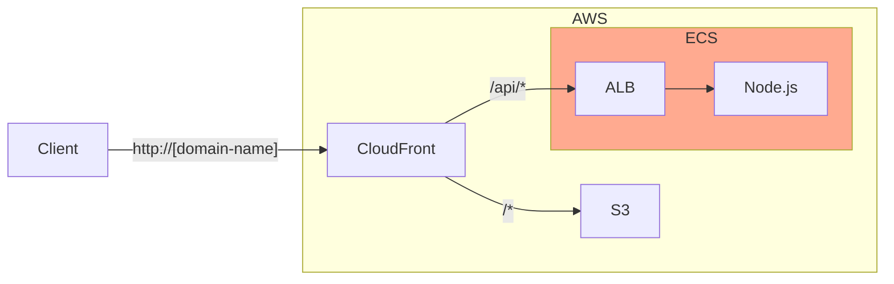

+++
title = "6. AWS: ECS"
description = "AWS의 컨테이너 관리 서비스인 ECS에 대해 알아봅니다."
icon = "article"
date = "2023-10-30"
lastmod = "2023-10-30"
weight = 360
+++

Amazon ECS는 AWS에서 제공하는 컨테이너 관리 서비스입니다. 쿠버네티스와 비슷하지만, 조금 더 쉽게 사용할 수 있어요.

이번 시간에는 스꾸딩 인프라 팀의 꽃이라고 할 수 있는 ECS에 대해 알아보겠습니다.

## 공부할 내용 📚

### 1. ELB

ELB는 AWS의 Load Balancer 서비스로, EC2와 함께 AWS에서 많이 사용됩니다. ELB로 요청을 분산시키고, EC2 개수를 늘리면서 서버의 확장성을 높일 수 있습니다.

- Load Balancer의 주요 기능을 알아봐요. (Load Balancing, High Availability, Fault Tolerance)
- ELB의 종류를 알아봐요. (Application Load Balancer, Network Load Balancer, Classic Load Balancer)
- ELB의 요금을 알아봐요.
- ELB의 주요 설정을 알아봐요. (Listener, Target Group, Health Check)

#### 참고 자료

> TODO: 자료 추가

### 2. Amazon ECR

Amazon ECR은 AWS에서 제공하는 Docker Registry 서비스로, Docker 이미지를 저장하고, 관리할 수 있습니다. AWS에서 컨테이너를 사용할 때는 ECR을 사용하는 것이 일반적이예요.

- ECR이 어떤 서비스인지, 어떤 기능을 제공하는지 알아봐요.
- 다른 저장소 대신 ECR을 사용하는 이유를 알아봐요.

#### 참고 자료

> TODO: 자료 추가

### 3. Amazon ECS

Amazon ECS는 AWS에서 제공하는 컨테이너 오케스트레이션 서비스로, 컨테이너를 쉽게 관리할 수 있도록 도와줍니다.

- ECS의 기본 개념을 알아봐요.
- ECS의 용어들과 구성을 알아봐요. (Cluster, Task Definition, Task, Service)
- ECS의 실행 모델을 알아봐요. (Fargate, EC2)
- ECS의 요금을 알아봐요.

#### 참고 자료

> TODO: 자료 추가

## 프로젝트 실습 🎈

이번 주에는 Node.js 컨테이너를 ECS로 구성해봐요. 아래 그림처럼 지난 주에 EC2로 ALB와 EC2로 구성한 부분을 ECS로 대체할 거예요.

