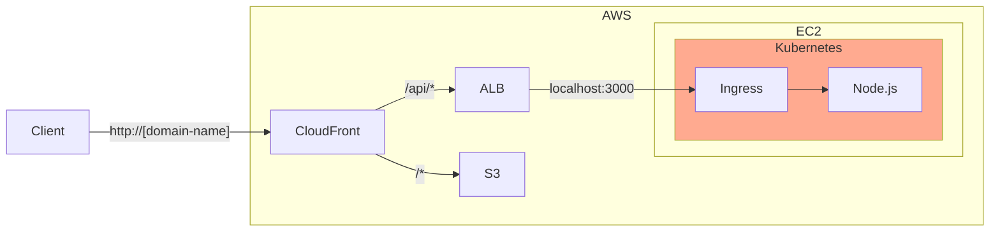

+++
title = "6. Kubernetes (k8s)"
description = "컨테이너 오케스트레이션 도구인 Kubernetes에 대해 알아봅니다."
icon = "article"
date = "2023-10-30"
lastmod = "2025-07-07"
weight = 360
+++

Kubernetes는 컨테이너 오케스트레이션 도구로, 여러 개의 컨테이너를 관리하고, 배포할 수 있도록 도와줍니다.
이번 시간에는 많은 기업에서 인프라 팀이라면 필수인 Kubernetes에 대해 알아보겠습니다.

## 공부할 내용 📚

### 1. YAML 문법

Kubernetes는 YAML 파일로 리소스를 정의합니다.
YAML은 데이터를 표현하기 위한 포맷으로, JSON과 비슷하지만 더 간결하고 읽기 쉽습니다.

#### 참고 자료

- **[쿠버네티스 안내서 "YAML 문법"](https://subicura.com/k8s/prepare/yaml.html)**: YAML의 기본 문법을 정리한 글입니다.
- **[인파 'YAML 개념 & 문법 마스터 하기'](https://inpa.tistory.com/entry/YAML-%F0%9F%93%9A-yaml-%EA%B0%9C%EB%85%90-%EB%AC%B8%EB%B2%95-%EC%9D%B4%ED%95%B4%ED%95%98%EA%B8%B0-%F0%9F%92%AF-%EC%B4%9D%EC%A0%95%EB%A6%AC)**: JSON과 비교하며 YAML의 내용을 자세히 설명한 글입니다.

### 2. Kubernetes

Kubernetes는 여러 서버에서 많은 컨테이너를 관리하기 위한 도구입니다.
Kubernetes가 복잡한 도구로 많이 알려져 있지만, **'원하는 상태와 실제 상태를 동기화하는 도구'라는 핵심 철학**을 이해하면 어렵지 않게 사용할 수 있습니다.

Kubernetes 자체를 설치하는 것은 매우 까다롭기 때문에, minikube나 k3s를 설치해서 실습하는 걸 추천드립니다.

아래 핵심 개념들은 꼭 익혀두는 걸 추천드립니다.

- kubectl 명령어
- Cluster, Node, Pod, Container의 관계
- Control Plane(Master Node)와 Worker Node의 역할
- Ingress와 Service를 통한 네트워크 설정
- Deployment, ConfigMap, Secret, Volume 등의 리소스

조금 더 깊이 알아보고 싶다면, 내부 구조도 공부해보면 좋습니다.

- Control Plane과 Worker Node를 이루는 내부 components
  - Control Plane: kube-apiserver, etcd, kube-controller-manager, kube-scheduler
  - Worker Node: kubelet, kube-proxy, container runtime (Docker, containerd 등)

#### 참고 자료

- **[Subicura "쿠버네티스 시작하기"](https://subicura.com/2019/05/19/kubernetes-basic-1.html)**: Kubernetes의 기본 개념을 다루는 글입니다.
- **[쿠버네티스 안내서](https://subicura.com/k8s/)**: Kubernetes의 기본 개념들을 실습과 함께 자세히 정리한 글입니다. 분량이 조금 많지만, Kubernetes를 처음 접하는 분들에게는 좋은 자료입니다.
- **[삼성 SDS 쿠버네티스 알아보기](https://www.samsungsds.com/kr/insights/kubernetes-3.html)**: Kubernetes의 내부 구성 요소들을 정리한 글입니다.

## 프로젝트 실습 🎈

이번 주에는 Kubernetes를 이용해서 Node.js 컨테이너를 스케일링해볼 거예요.
아래 그림처럼 EC2 내에 Docker compose로 구성했던 Node.js 서버를 Kubernetes로 구성해볼 거예요.





### EC2 인스턴스는 새로 생성해주세요.

- [k3s의 최소 요구사항](https://docs.k3s.io/installation/requirements)에 맞게 아래 조건을 지켜주세요.
  - **운영체제**: Ubuntu 20.04 LTS 이상 (24.04 LTS 권장)
  - **인스턴스 타입**: t3.small 이상 (2 CPU, 2GB RAM 이상)
  - **스토리지**: SSD 20GB 이상 할당
  - **보안 그룹**: 22(SSH), 6443(Kubernetes API) 포트가 inbound로 열려있어야 합니다.
- EC2 인스턴스 내부에 Docker와 k3s를 설치해주세요.

```bash
# Docker 설치
curl -fsSL https://get.docker.com | sudo sh -

# k3s 설치
curl -sfL https://get.k3s.io | INSTALL_K3S_EXEC="server --tls-san=$(curl ifconfig.me) --write-kubeconfig-mode=644" sh
```

### 원격 kubectl 접속을 설정하세요.

- 로컬 환경에 kubectl을 설치하세요. ([공식 가이드](https://kubernetes.io/docs/tasks/tools/))
- 서버에서 명령어 `sudo cat /etc/rancher/k3s/k3s.yaml`로 kubeconfig를 확인하세요.
- 출력된 kubeconfig를 복사해 로컬의 `~/.kube/remote-config` 파일에 저장하세요.
- kubeconfig 파일에서 `server` 항목의 IP 주소를 EC2 인스턴스의 퍼블릭 IP로 변경하세요.

```yaml
server: https://[EC2-PUBLIC-IP]:6443
```

- KUBECONIFG 환경 변수를 설정하세요.

```bash
export KUBECONFIG=~/.kube/remote-config
```

- kubectl 명령어로 EC2 인스턴스에 접속이 잘 되는지 확인하세요.

```bash
kubectl get all
```

### Deployment를 YAML 파일로 작성하세요.

- Node.js 컨테이너를 실행하는 Deployment YAML 파일을 작성하세요.
- 2개의 Node.js 컨테이너를 실행하도록 설정하세요.
- kubectl 명령어로 잘 배포되었는지 확인해보세요.

### Service를 YAML 파일로 작성하세요.

- Node.js 서비스를 외부에 노출할 수 있도록 Service를 작성하세요.
- 외부에 31000 포트로 노출되도록 설정하세요. (EC2 보안 그룹에서도 31000 포트를 열어주세요.)
- 직접 curl 명령어로 Node.js 서비스를 확인해보세요.
- ALB의 target group에 EC2 인스턴스의 31000 포트를 추가하세요.
