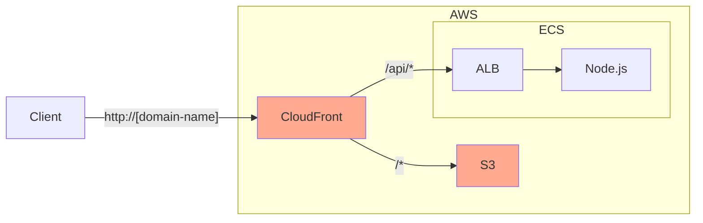

+++
title = "7. Terraform"
description = "프로비저닝 도구인 Terraform에 대해 알아봅니다."
icon = "article"
date = "2023-09-11"
lastmod = "2023-10-05"
weight = 370
+++

Terraform은 HashiCorp에서 만든 인프라 프로비저닝 도구입니다. Terraform을 사용하면 코드로 인프라를 관리할 수 있어요. 이번 시간에는 IaC(Infrastructure as Code)를 구현할 수 있는 Terraform에 대해 알아보겠습니다.

## 공부할 내용 📚

### 1. Terraform

Terraform을 사용하면 코드로 인프라를 관리할 수 있어요. Terraform은 다양한 클라우드 서비스를 지원하고, 다양한 리소스를 관리할 수 있습니다.

- IaC(Infrastructure as Code)란 무엇인지 알아봐요.
- Terraform이 어떤 도구인지 알아봐요.
- Terraform의 주요 용어를 알아봐요. (Provider, Resource, State)
- Terraform의 주요 명령어를 알아봐요. (init, plan, apply, destroy)

#### 참고 자료

- **[44bits "테라폼(Terraform)이란?"](https://www.44bits.io/ko/keyword/terraform)**: Terraform의 배경부터 개념, 튜토리얼까지 정리해놓은 글입니다.
- **[인프런 Terraform & AWS 101 "Terraform 기본"](https://terraform101.inflearn.devopsart.dev/preparation/terraform-basic/)**: Terraform의 용어와 명령어들을 정리한 글입니다.

### 2. HCL 문법

Terraform은 HCL(HashiCorp Configuration Language)이라는 독자적인 언어를 사용해요. HCL은 JSON과 비슷한 문법을 가지고 있어요.

- HCL의 기본 문법을 알아봐요. (Block, Argument, Expression)
- HCL의 주요 함수를 간략하게 알아봐요. (for_each, lookup, file, templatefile)

#### 참고 자료

- **[GeeksForGeeks "Terraform Syntax With Examples"](https://www.geeksforgeeks.org/terraform-syntax-with-examples/)**: HCL의 기본 문법을 정리한 글입니다.
- **[Terraform Functions](https://developer.hashicorp.com/terraform/language/functions)**: HCL의 주요 함수들을 정리한 공식 문서입니다. 아래 내용은 자세히 볼 필요 없고, 각 함수의 예시를 보면서 어떤 함수가 있는지만 확인해주세요.
  - **[Terraform for_each Meta-Argument](https://developer.hashicorp.com/terraform/language/meta-arguments/for_each)**
  - **[Terraform lookup Function](https://developer.hashicorp.com/terraform/language/functions/lookup)**
  - **[Terraform file Function](https://developer.hashicorp.com/terraform/language/functions/file)**
  - **[Terraform templatefile Function](https://developer.hashicorp.com/terraform/language/functions/templatefile)**

## 프로젝트 실습 🎈

그동안 AWS에 구성한 인프라를 Terraform으로 관리해봐요. 다만 일주일 안에 전부 Terraform으로 옮기기엔 양이 너무 많아서 **CloudFront와 S3만** Terraform으로 옮기는 걸로 해요.

### AWS CLI를 설치하세요.

- [지난 주차 내용](../infra/6.%20AWS:%20ECS.md#aws-cli를-설치하세요)을 참고해주세요.
- `aws s3 ls` 명령어가 잘 실행되는지 확인해주세요.

### Terraform을 설치하세요.

- [Terraform 공식 사이트](https://www.terraform.io/downloads.html)에서 Terraform을 다운받아 설치하세요.
- VSCode에 "HashiCorp Terraform" 확장 프로그램을 설치하세요.

### AWS Provider로 S3를 구성하세요.



> AWS Provider 공식 문서: https://registry.terraform.io/providers/hashicorp/aws/latest/docs

- [공식 문서 예시](https://registry.terraform.io/providers/hashicorp/aws/latest/docs#example-usage)처럼 파일을 만들어주세요. (예: main.tf) Region은 `ap-northeast-2`로 설정하세요.
- `terraform init` 명령어로 AWS Provider를 설치하세요.
- `terraform plan` 명령어로 AWS에 적용할 내용을 확인하세요.
- `terraform apply` 명령어로 AWS에 적용하세요.
- AWS에 VPC가 잘 생성되었는지 확인하세요. [VPC Console 링크](https://ap-northeast-2.console.aws.amazon.com/vpcconsole/home?region=ap-northeast-2)
- `terraform destroy` 명령어로 AWS에 생성한 리소스를 삭제하세요.

#### 1️⃣ S3 Bucket을 생성하세요.

[aws_s3_bucket 문서](https://registry.terraform.io/providers/hashicorp/aws/latest/docs/resources/s3_bucket)를 참고해서 S3 Bucket을 생성하세요.

#### 2️⃣ S3에 파일을 업로드하세요.

[aws_s3_object 문서](https://registry.terraform.io/providers/hashicorp/aws/latest/docs/resources/s3_object)를 참고해서 S3에 파일을 업로드하세요.

- 5주차 실습의 HTML, CSS, JS 파일을 각각 올려주세요.
- content_type을 `text/html`, `text/css`, `application/javascript`로 설정해주세요.
- etag를 설정해주세요. 그래야 파일 내용이 변경됐을 때 다시 업로드할 수 있어요.

#### 3️⃣ S3 website를 구성하세요.

[aws_s3_bucket_website_configuration 문서](https://registry.terraform.io/providers/hashicorp/aws/latest/docs/resources/s3_bucket_website_configuration)를 참고해서 S3 website를 구성하세요.

- IAM Policy를 5주차 내용처럼 설졍해주세요. [aws_iam_policy_document 문서](https://registry.terraform.io/providers/hashicorp/aws/latest/docs/data-sources/iam_policy_document)
- IAM Policy Document를 S3에 연결해주세요. [s3_bucket_policy 문서](https://registry.terraform.io/providers/hashicorp/aws/latest/docs/resources/s3_bucket_policy)
- Public Access Block을 해제해주세요. [aws_s3_bucket_public_access_block 문서](https://registry.terraform.io/providers/hashicorp/aws/latest/docs/resources/s3_bucket_public_access_block)
- 웹사이트 접속이 잘 되는지 확인해보세요.

#### 4️⃣ CloudFront를 생성하세요.

[aws_cloudfront_distribution 문서](https://registry.terraform.io/providers/hashicorp/aws/latest/docs/resources/cloudfront_distribution)를 참고해서 CloudFront를 생성하세요.

- 생성에 시간이 좀 걸릴 수 있어요.
- S3 Bucket을 Origin으로 설정해주세요.
- 지난 주차 실습에서 만든 ALB를 data source로 가져와 Origin으로 설정해주세요. [aws_lb 문서](https://registry.terraform.io/providers/hashicorp/aws/latest/docs/data-sources/lb)
- `default_cache_behavior`에 S3를, `ordered_cache_behavior`에 ALB를 추가해주세요.
- CloudFront 접속이 잘 되는지 확인해보세요.
