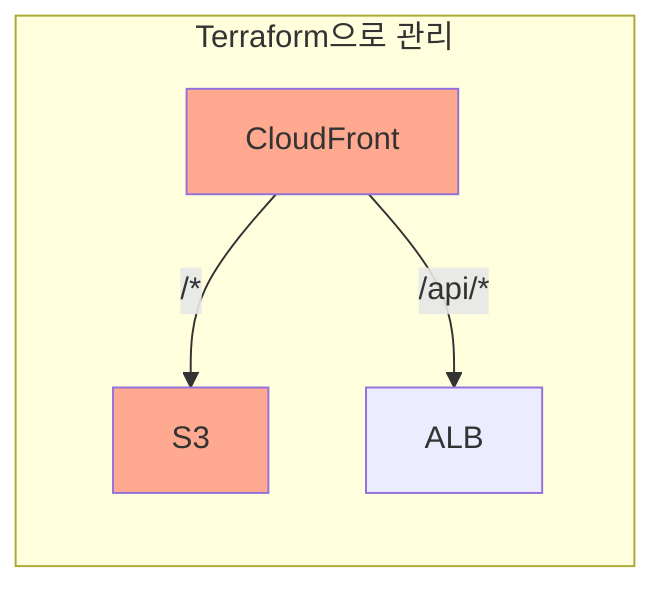

+++
title = "7. Terraform"
description = "Terraform으로 인프라를 코드로 관리합니다."
icon = "article"
weight = 370
+++

지금까지 AWS 리소스를 콘솔에서 클릭으로 만들었어요. 하지만 프로덕션에서는 이렇게 하지 않아요. **왜?**

- 누가 어떤 리소스를 만들었는지 추적할 수 없어요.
- 동일한 환경을 재현하려면 처음부터 다시 클릭해야 해요.
- 실수로 설정 하나 잘못 누르면 돌이킬 수 없어요.

**Terraform**은 인프라를 코드(IaC, Infrastructure as Code)로 관리하는 도구예요. 코드로 관리하면 Git으로 버전 관리, 코드 리뷰, 롤백이 가능해져요.

## 공부할 내용

### Terraform 핵심 개념

아래 개념들을 이해하세요:

- **Provider:** 어떤 클라우드/서비스를 관리할지 (aws, gcp, azure, kubernetes 등)
- **Resource:** 관리할 인프라 요소 (aws_instance, aws_s3_bucket 등)
- **State:** 현재 인프라의 상태를 저장하는 파일. Terraform은 이 파일과 코드를 비교해서 변경점을 계산해요.
- **Data Source:** 이미 존재하는 리소스를 읽어오는 것 (직접 만들지 않음)

### 핵심 명령어

```bash
terraform init     # Provider 다운로드, 초기화
terraform plan     # 변경 사항 미리보기 (실제 적용 안 함)
terraform apply    # 변경 사항 적용
terraform destroy  # 리소스 전체 삭제
```

`plan` → `apply` 워크플로우가 핵심이에요. **항상 plan으로 먼저 확인**하고 apply하세요.

### HCL 문법

Terraform은 HCL(HashiCorp Configuration Language)이라는 자체 문법을 사용해요. `provider`, `resource`, `variable`, `output`, `data` 블록의 기본 구조를 익히세요.

### Terraform Backend

이번 실습에서는 State 파일을 **로컬에 저장**해요. 하지만 프로덕션에서는 절대 이렇게 하면 안 됩니다:

- 로컬 파일은 다른 팀원과 공유할 수 없고, 실수로 삭제하면 복구 불가
- CI/CD에서 `terraform apply`를 실행하려면 원격 저장소가 필수
- 여러 사람이 동시에 `apply`하면 State가 꼬일 수 있음 (locking 필요)

프로덕션에서는 **S3 + DynamoDB** (locking용) 같은 Remote Backend에 State를 저장해요. 자세한 내용은 [Terraform Backend 공식 문서](https://developer.hashicorp.com/terraform/language/backend)를 참고하세요.

### 참고 자료

- **[44bits "테라폼(Terraform)이란?"](https://www.44bits.io/ko/keyword/terraform)**: Terraform의 배경부터 튜토리얼까지 정리한 글입니다.
- **[인프런 Terraform & AWS 101 "Terraform 기본"](https://terraform101.inflearn.devopsart.dev/preparation/terraform-basic/)**: 용어와 명령어 정리.
- **[AWS Provider 공식 문서](https://registry.terraform.io/providers/hashicorp/aws/latest/docs)**: Terraform으로 AWS 리소스를 관리할 때 필수 문서.

---

## 프로젝트 실습

Session 5에서 콘솔로 만들었던 S3와 CloudFront를 Terraform 코드로 재현해볼 거예요.


```mermaid
flowchart LR
  subgraph "Terraform으로 관리"
    CloudFront -- "/*" --> S3
    CloudFront -- "/api/*" --> ALB
    style CloudFront fill:#ffaa90
    style S3 fill:#ffaa90
  end
```

### Terraform 설치

```bash
# Mac
brew install terraform

# Linux
# https://developer.hashicorp.com/terraform/install 참고

# VSCode 확장: "HashiCorp Terraform" 설치
```

### AWS CLI 설정 확인

```bash
aws configure
# Session 4에서 만든 IAM User의 Access Key 사용
```

### 실습: S3 + CloudFront를 Terraform으로 구성

**요구사항:**

Session 5에서 콘솔로 만들었던 것과 동일한 구성을 Terraform 코드로 작성하세요:

1. **S3 Bucket** — Static Website Hosting 활성화, Public Access 설정, Bucket Policy


2. **S3 Object** — 프론트엔드 HTML 파일 업로드
3. **CloudFront Distribution** — S3와 ALB를 Origin으로, path pattern으로 라우팅
4. 기존 ALB는 `data` 블록으로 참조하세요 (Terraform으로 새로 만들지 않음)

**진행 방법:**

AWS Provider 공식 문서를 펴놓고 작업하세요. 각 리소스(`aws_s3_bucket`, `aws_s3_bucket_website_configuration`, `aws_cloudfront_distribution` 등)의 문서에서 필요한 인자를 찾아보세요. 문서 없이는 어렵습니다!

```bash
terraform init    # Provider 설치
terraform plan    # 변경 사항 확인
terraform apply   # 적용 (yes 입력)
```

각 단계를 한 번에 다 하려 하지 말고, **S3부터 만들고 확인, 그 다음 CloudFront** 순서로 점진적으로 진행하세요.




