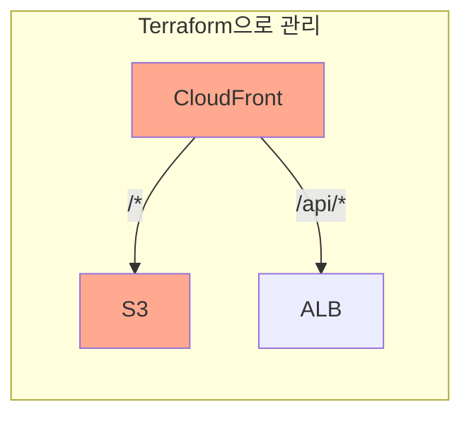

+++
title = "7. Terraform"
description = "Terraform으로 인프라를 코드로 관리합니다."
icon = "article"
weight = 370
+++

지금까지 AWS 리소스를 콘솔에서 클릭으로 만들었어요. 하지만 프로덕션에서는 이렇게 하지 않아요. **왜?**

- 누가 어떤 리소스를 만들었는지 추적할 수 없어요.
- 동일한 환경을 재현하려면 처음부터 다시 클릭해야 해요.
- 실수로 설정 하나 잘못 누르면 돌이킬 수 없어요.

**Terraform**은 인프라를 코드(IaC, Infrastructure as Code)로 관리하는 도구예요. 코드로 관리하면 Git으로 버전 관리, 코드 리뷰, 롤백이 가능해져요.

## 공부할 내용

### IaC란?

인프라를 수동 설정 대신 **코드 파일로 정의**하고, 이 코드를 실행해서 인프라를 생성/수정/삭제하는 것이에요. 코드이므로 Git으로 버전 관리, 코드 리뷰, 롤백이 가능해요.

### Terraform 핵심 개념

- **Provider:** 어떤 클라우드/서비스를 관리할지 (aws, gcp, azure, kubernetes 등)
- **Resource:** 관리할 인프라 요소 (aws_instance, aws_s3_bucket 등)
- **State:** 현재 인프라의 상태를 저장하는 파일. Terraform은 이 파일과 코드를 비교해서 변경점을 계산해요.
- **Data Source:** 이미 존재하는 리소스를 읽어오는 것 (직접 만들지 않음)

### 핵심 명령어

```bash
terraform init     # Provider 다운로드, 초기화
terraform plan     # 변경 사항 미리보기 (실제 적용 안 함)
terraform apply    # 변경 사항 적용
terraform destroy  # 리소스 전체 삭제
```

`plan` → `apply` 워크플로우가 핵심이에요. **항상 plan으로 먼저 확인**하고 apply하세요.

### HCL 문법 (기초)

```hcl
# Provider 설정
provider "aws" {
  region = "ap-northeast-2"
}

# S3 버킷 생성
resource "aws_s3_bucket" "frontend" {
  bucket = "my-frontend-bucket"
}

# 변수
variable "environment" {
  default = "dev"
}

# 출력
output "bucket_arn" {
  value = aws_s3_bucket.frontend.arn
}
```

### Terraform Backend

Terraform의 state 파일을 로컬이 아닌 **S3에 저장**해야 팀원들과 공유하고, CI/CD에서도 사용할 수 있어요.

```hcl
terraform {
  backend "s3" {
    bucket = "my-terraform-state-bucket"
    key    = "my-server/terraform.tfstate"
    region = "ap-northeast-2"
  }
}
```

### 참고 자료

- **[44bits "테라폼(Terraform)이란?"](https://www.44bits.io/ko/keyword/terraform)**: Terraform의 배경부터 튜토리얼까지 정리한 글입니다.
- **[인프런 Terraform & AWS 101 "Terraform 기본"](https://terraform101.inflearn.devopsart.dev/preparation/terraform-basic/)**: 용어와 명령어 정리.
- **[AWS Provider 공식 문서](https://registry.terraform.io/providers/hashicorp/aws/latest/docs)**: Terraform으로 AWS 리소스를 관리할 때 필수 문서.

---

## 프로젝트 실습

Session 5에서 콘솔로 만들었던 S3와 CloudFront를 Terraform 코드로 재현해볼 거예요.


```mermaid
flowchart LR
  subgraph "Terraform으로 관리"
    CloudFront -- "/*" --> S3
    CloudFront -- "/api/*" --> ALB
    style CloudFront fill:#ffaa90
    style S3 fill:#ffaa90
  end
```

### Terraform 설치

```bash
# Mac
brew install terraform

# Linux
# https://developer.hashicorp.com/terraform/install 참고

# VSCode 확장: "HashiCorp Terraform" 설치
```

### AWS CLI 설정 확인

```bash
aws configure
# Session 4에서 만든 IAM User의 Access Key 사용
```

### S3 Bucket 생성

```hcl
# main.tf
provider "aws" {
  region = "ap-northeast-2"
}

resource "aws_s3_bucket" "frontend" {
  bucket = "my-frontend-unique-name"  # 전 세계 유일해야 함
}

resource "aws_s3_bucket_website_configuration" "frontend" {
  bucket = aws_s3_bucket.frontend.id
  index_document { suffix = "index.html" }
}
```

```bash
terraform init    # Provider 설치
terraform plan    # 변경 사항 확인
terraform apply   # 적용 (yes 입력)
```

AWS Console에서 S3 버킷이 생성되었는지 확인하세요!

### S3에 파일 업로드

```hcl
resource "aws_s3_object" "index" {
  bucket       = aws_s3_bucket.frontend.id
  key          = "index.html"
  source       = "frontend/index.html"
  content_type = "text/html"
  etag         = filemd5("frontend/index.html")
}
```

### Bucket Policy + Public Access

```hcl
resource "aws_s3_bucket_public_access_block" "frontend" {
  bucket                  = aws_s3_bucket.frontend.id
  block_public_acls       = false
  block_public_policy     = false
  ignore_public_acls      = false
  restrict_public_buckets = false
}

data "aws_iam_policy_document" "frontend_public" {
  statement {
    principals {
      type        = "*"
      identifiers = ["*"]
    }
    actions   = ["s3:GetObject"]
    resources = ["${aws_s3_bucket.frontend.arn}/*"]
  }
}

resource "aws_s3_bucket_policy" "frontend" {
  bucket = aws_s3_bucket.frontend.id
  policy = data.aws_iam_policy_document.frontend_public.json
}
```

### CloudFront Distribution

```hcl
# AWS 관리형 캐시 정책 참조
data "aws_cloudfront_cache_policy" "caching_optimized" {
  name = "Managed-CachingOptimized"
}

data "aws_cloudfront_cache_policy" "caching_disabled" {
  name = "Managed-CachingDisabled"
}

data "aws_cloudfront_origin_request_policy" "all_viewer" {
  name = "Managed-AllViewer"
}

resource "aws_cloudfront_distribution" "main" {
  enabled             = true
  default_root_object = "index.html"

  # S3 Origin
  origin {
    domain_name = aws_s3_bucket_website_configuration.frontend.website_endpoint
    origin_id   = "s3-frontend"
    custom_origin_config {
      http_port              = 80
      https_port             = 443
      origin_protocol_policy = "http-only"
      origin_ssl_protocols   = ["TLSv1.2"]
    }
  }

  # ALB Origin (기존 ALB를 data source로 참조)
  origin {
    domain_name = data.aws_lb.existing_alb.dns_name
    origin_id   = "alb-api"
    custom_origin_config {
      http_port              = 80
      https_port             = 443
      origin_protocol_policy = "http-only"
      origin_ssl_protocols   = ["TLSv1.2"]
    }
  }

  default_cache_behavior {
    allowed_methods        = ["GET", "HEAD"]
    cached_methods         = ["GET", "HEAD"]
    target_origin_id       = "s3-frontend"
    viewer_protocol_policy = "allow-all"
    cache_policy_id        = data.aws_cloudfront_cache_policy.caching_optimized.id
  }

  ordered_cache_behavior {
    path_pattern             = "/api/*"
    allowed_methods          = ["DELETE", "GET", "HEAD", "OPTIONS", "PATCH", "POST", "PUT"]
    cached_methods           = ["GET", "HEAD"]
    target_origin_id         = "alb-api"
    viewer_protocol_policy   = "allow-all"
    cache_policy_id          = data.aws_cloudfront_cache_policy.caching_disabled.id
    origin_request_policy_id = data.aws_cloudfront_origin_request_policy.all_viewer.id
  }

  restrictions {
    geo_restriction { restriction_type = "none" }
  }
  viewer_certificate {
    cloudfront_default_certificate = true
  }
}

# 기존 ALB를 data source로 참조
data "aws_lb" "existing_alb" {
  name = "your-alb-name"
}
```

```bash
terraform plan    # CloudFront 생성 내용 확인
terraform apply   # 적용 (생성에 몇 분 소요)
```


