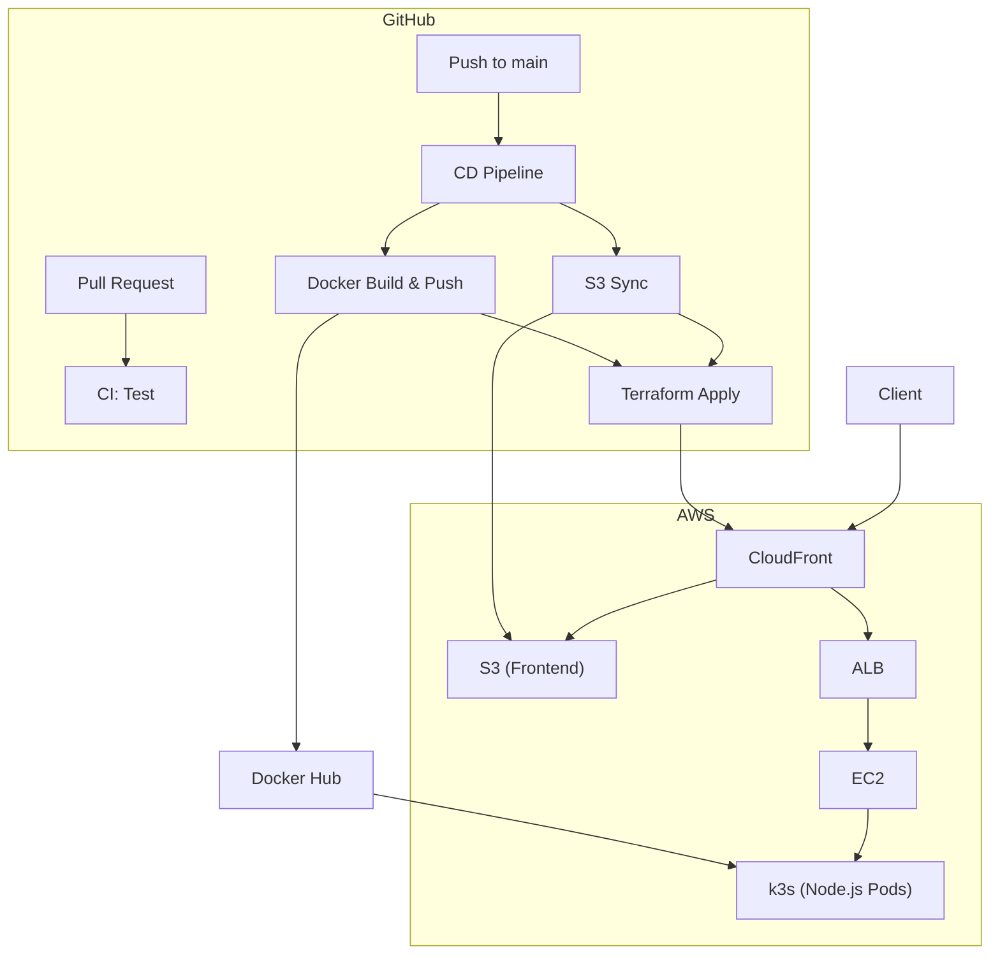

+++
title = "8. GitHub Actions"
description = "GitHub Actions로 CI/CD 파이프라인을 구축합니다."
icon = "article"
weight = 380
+++

Session 7에서 Terraform으로 인프라를 코드화했어요. 하지만 매번 로컬에서 `terraform apply`를 실행하고, 수동으로 Docker 이미지를 빌드하고, S3에 파일을 올리는 건 비효율적이에요.

**GitHub Actions**로 코드 변경 시 자동으로 테스트, 빌드, 배포하는 CI/CD 파이프라인을 구축할 거예요.

이번 주가 마지막 세션입니다. Session 1에서 시작한 서버가 이제 **코드로 관리되고, 자동으로 배포**되는 수준에 도달합니다!

## 공부할 내용

### CI/CD란?

- **CI (Continuous Integration):** 코드가 merge될 때 자동으로 테스트, 빌드하여 문제를 조기 발견
- **CD (Continuous Delivery/Deployment):** 빌드된 결과물을 자동으로 스테이징/프로덕션에 배포

### GitHub Actions 핵심 개념

아래 개념들의 관계를 이해하세요: **Workflow**, **Event**, **Job**, **Step**, **Action**, **Secret**.

특히:
- Workflow는 `.github/workflows/` 디렉토리의 YAML 파일이라는 것
- 각 Job은 별도의 VM에서 실행된다는 것
- Secret으로 민감한 정보를 안전하게 관리한다는 것

### 참고 자료

- **[Red Hat "CI/CD란?"](https://www.redhat.com/ko/topics/devops/what-is-ci-cd)**: CI, CD(Delivery/Deployment)의 개념과 차이를 설명합니다.
- **[GitHub Actions 공식 문서](https://docs.github.com/en/actions)**: GitHub Actions의 구성 요소와 사용법을 다루는 공식 문서입니다.

---

## 프로젝트 실습

두 개의 Workflow를 작성합니다.



### Workflow 1: CI (ci.yml)

**요구사항:**
- 트리거: `main` 브랜치에 push 또는 Pull Request 생성 시
- 해야 할 일: 코드 checkout, Node.js 설정, 의존성 설치, 테스트 실행

필요한 Actions: `actions/checkout`, `actions/setup-node` — GitHub Marketplace에서 찾아보세요.

> CodeQL을 추가해서 보안 취약점도 자동으로 검사해보세요. 참고: [GitHub CodeQL 문서](https://docs.github.com/ko/code-security/code-scanning)

### Workflow 2: CD (cd.yml)

**요구사항:**
- 트리거: `main` 브랜치에 push 시
- 3개의 Job으로 구성:
  1. **deploy-frontend:** 프론트엔드 파일을 S3에 동기화
  2. **build-and-push:** Docker 이미지를 빌드해서 Docker Hub에 push
  3. **terraform:** 위 두 Job 완료 후 `terraform apply` 실행

각 Job에서 AWS에 접근해야 해요. Session 4에서 로컬 AWS CLI용으로 Access Key를 만들었는데, CI/CD에서는 사정이 달라요:

- 로컬에서는 본인만 접근하므로 Access Key를 `aws configure`로 등록해도 괜찮아요.
- 하지만 CI/CD에서 Access Key를 Secret에 저장하면, 키가 유출되었을 때 수동으로 교체해야 하고, 장기 자격 증명이라 피해 범위가 커요.
- **OIDC 인증**을 사용하면 임시 자격 증명을 자동 발급받아 훨씬 안전합니다 (아래 참조).

필요한 Actions: `aws-actions/configure-aws-credentials`, `docker/login-action` (Docker Hub용), `docker/build-push-action`, `hashicorp/setup-terraform` — 각각의 README를 읽고 사용법을 파악하세요.



### OIDC 인증 설정 (중요!)

GitHub Actions에서 AWS에 접근할 때 Access Key 대신 **OpenID Connect(OIDC)**를 사용하세요. 더 안전해요.

**설정 순서:**
1. AWS IAM에서 Identity Provider 추가 (OpenID Connect)
2. IAM Role 생성, Trust Policy에 GitHub repo 지정
3. 필요한 권한 정책 연결 (S3, CloudFront 등)
4. GitHub Repo의 Secrets에 `AWS_ROLE_ARN` 저장

OIDC 설정 방법은 `aws-actions/configure-aws-credentials` Action의 README에 상세히 나와 있어요.

---

## 전체 아키텍처 최종 모습

---

## 여기서부터는 어디로?

8주간 배운 내용을 기반으로 더 공부할 수 있는 방향들이에요.

### 바로 다음 단계

- **Terraform 심화:** 모듈, 워크스페이스, Remote State, 팀 워크플로우
- **K8s 심화:** Ingress Controller, HPA (Auto Scaling), PersistentVolume, RBAC
- **모니터링:** Prometheus + Grafana, OpenTelemetry, ELK Stack
- **보안:** IAM 심화, Network Policy, Pod Security Standards

### 중기 목표

- **EKS:** 매니지드 Kubernetes로 마이그레이션
- **ArgoCD:** GitOps 기반 CD
- **Service Mesh:** Istio / Linkerd
- **비용 최적화:** Spot Instance, Karpenter, 리소스 Right-sizing

### 추천 자료

- **[The 12-Factor App](https://12factor.net/ko/)**: 클라우드 네이티브 앱의 철학. 꼭 읽어보세요.
- **[Kubernetes The Hard Way](https://github.com/kelseyhightower/kubernetes-the-hard-way)**: K8s를 밑바닥부터 구축해보는 고급 튜토리얼.
- **[AWS Well-Architected Framework](https://aws.amazon.com/ko/architecture/well-architected/)**: AWS 아키텍처 설계의 모범 사례.
- **[DevOps Roadmap](https://roadmap.sh/devops)**: 전체적인 학습 로드맵.

---

수고하셨습니다! Session 1에서 `node server.js`로 시작한 서버가 이제 Docker로 컨테이너화되고, Kubernetes 위에서 실행되고, Terraform으로 관리되고, GitHub Actions로 자동 배포되고 있어요. 이게 인프라의 핵심 흐름입니다.
