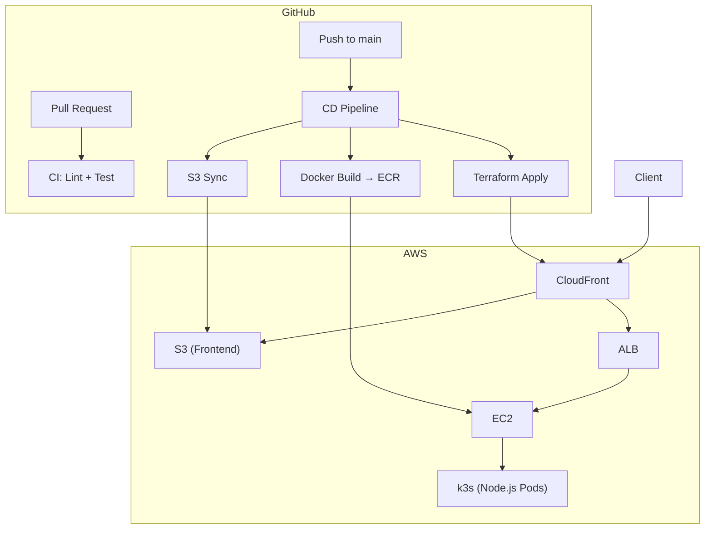

+++
title = "8. GitHub Actions"
description = "GitHub Actions로 CI/CD 파이프라인을 구축합니다."
icon = "article"
weight = 380
+++

Session 7에서 Terraform으로 인프라를 코드화했어요. 하지만 매번 로컬에서 `terraform apply`를 실행하고, 수동으로 Docker 이미지를 빌드하고, S3에 파일을 올리는 건 비효율적이에요.

**GitHub Actions**로 코드 변경 시 자동으로 테스트, 빌드, 배포하는 CI/CD 파이프라인을 구축할 거예요.

이번 주가 마지막 세션입니다. Session 1에서 시작한 서버가 이제 **코드로 관리되고, 자동으로 배포**되는 수준에 도달합니다!

## 공부할 내용

### CI/CD란?

- **CI (Continuous Integration):** 코드가 merge될 때 자동으로 테스트, 빌드하여 문제를 조기 발견
- **CD (Continuous Delivery/Deployment):** 빌드된 결과물을 자동으로 스테이징/프로덕션에 배포

### GitHub Actions 핵심 개념

- **Workflow:** `.github/workflows/` 디렉토리의 YAML 파일. CI/CD 파이프라인 정의.
- **Event:** Workflow를 실행하는 트리거 (push, pull_request, schedule 등)
- **Job:** Workflow 안의 실행 단위. 각 Job은 별도의 VM에서 실행.
- **Step:** Job 안의 개별 작업. 셸 명령어 또는 Action 사용.
- **Action:** 재사용 가능한 자동화 단위 (예: `actions/checkout`, `docker/build-push-action`)
- **Secret:** 민감한 정보 (API 키, 토큰 등)를 안전하게 저장

### 참고 자료

- **["CI/CD란 무엇일까?"](https://jud00.tistory.com/entry/CICD%EB%9E%80-%EB%AC%B4%EC%97%87%EC%9D%BC%EA%B9%8C)**: CI/CD 개념을 정리한 글입니다.
- **[Dalseo "GitHub Actions의 소개와 핵심 개념"](https://www.daleseo.com/github-actions-basics/)**: GitHub Actions의 구성 요소를 정리한 글입니다.
- **[Dalseo "GitHub Actions 첫 워크플로우 생성해보기"](https://www.daleseo.com/github-actions-first-workflow/)**: 실습과 함께 배우는 글입니다.

---

## 프로젝트 실습

두 개의 Workflow를 작성합니다.



### Workflow 1: CI (ci.yml)

`main` 브랜치에 push 또는 Pull Request가 생성되면 실행.

```yaml
# .github/workflows/ci.yml
name: CI

on:
  push:
    branches: [main]
  pull_request:
    branches: [main]

jobs:
  lint-and-test:
    runs-on: ubuntu-latest
    steps:
      - uses: actions/checkout@v4
      - uses: actions/setup-node@v4
        with:
          node-version: '24'
      - run: npm ci
      - run: npm test        # 테스트 스크립트가 있다면
```

> CodeQL을 추가해서 보안 취약점도 자동으로 검사해보세요. 참고: [GitHub CodeQL 문서](https://docs.github.com/ko/code-security/code-scanning)

### Workflow 2: CD (cd.yml)

`main` 브랜치에 push되면 실행. 세 개의 Job으로 구성.

```yaml
# .github/workflows/cd.yml
name: CD

on:
  push:
    branches: [main]

jobs:
  deploy-frontend:
    runs-on: ubuntu-latest
    permissions:
      id-token: write
      contents: read
    steps:
      - uses: actions/checkout@v4
      - uses: aws-actions/configure-aws-credentials@v4
        with:
          role-to-assume: ${{ secrets.AWS_ROLE_ARN }}
          aws-region: ap-northeast-2
      - run: aws s3 sync frontend/ s3://${{ secrets.S3_BUCKET_NAME }}

  build-and-push:
    runs-on: ubuntu-latest
    permissions:
      id-token: write
      contents: read
    steps:
      - uses: actions/checkout@v4
      - uses: aws-actions/configure-aws-credentials@v4
        with:
          role-to-assume: ${{ secrets.AWS_ROLE_ARN }}
          aws-region: ap-northeast-2
      - uses: aws-actions/amazon-ecr-login@v2
      - uses: docker/build-push-action@v7
        with:
          push: true
          tags: ${{ secrets.ECR_REPO }}:${{ github.sha }}

  terraform:
    needs: [deploy-frontend, build-and-push]
    runs-on: ubuntu-latest
    permissions:
      id-token: write
      contents: read
    steps:
      - uses: actions/checkout@v4
      - uses: aws-actions/configure-aws-credentials@v4
        with:
          role-to-assume: ${{ secrets.AWS_ROLE_ARN }}
          aws-region: ap-northeast-2
      - uses: hashicorp/setup-terraform@v3
      - run: terraform init
      - run: terraform apply -auto-approve
```

### OIDC 인증 설정 (중요!)

GitHub Actions에서 AWS에 접근할 때 Access Key 대신 **OpenID Connect(OIDC)**를 사용하세요. 더 안전해요.

1. AWS IAM > Identity Providers > Add Provider > OpenID Connect
   - URL: `https://token.actions.githubusercontent.com`
   - Audience: `sts.amazonaws.com`
2. IAM Role 생성 > Trust Policy에 GitHub repo 지정
3. 필요한 권한 정책 연결 (S3, ECR, CloudFront 등)
4. GitHub Repo > Settings > Secrets에 `AWS_ROLE_ARN` 저장

---

## 전체 아키텍처 최종 모습



---

## 여기서부터는 어디로?

8주간 배운 내용을 기반으로 더 공부할 수 있는 방향들이에요.

### 바로 다음 단계

- **Terraform 심화:** 모듈, 워크스페이스, Remote State, 팀 워크플로우
- **K8s 심화:** Ingress Controller, HPA (Auto Scaling), PersistentVolume, RBAC
- **모니터링:** Prometheus + Grafana, OpenTelemetry, ELK Stack
- **보안:** IAM 심화, Network Policy, Pod Security Standards

### 중기 목표

- **EKS:** 매니지드 Kubernetes로 마이그레이션
- **ArgoCD:** GitOps 기반 CD
- **Service Mesh:** Istio / Linkerd
- **비용 최적화:** Spot Instance, Karpenter, 리소스 Right-sizing

### 추천 자료

- **[The 12-Factor App](https://12factor.net/ko/)**: 클라우드 네이티브 앱의 철학. 꼭 읽어보세요.
- **[Kubernetes The Hard Way](https://github.com/kelseyhightower/kubernetes-the-hard-way)**: K8s를 밑바닥부터 구축해보는 고급 튜토리얼.
- **[AWS Well-Architected Framework](https://aws.amazon.com/ko/architecture/well-architected/)**: AWS 아키텍처 설계의 모범 사례.
- **[DevOps Roadmap](https://roadmap.sh/devops)**: 전체적인 학습 로드맵.

---

수고하셨습니다! Session 1에서 `node server.js`로 시작한 서버가 이제 Docker로 컨테이너화되고, Kubernetes 위에서 실행되고, Terraform으로 관리되고, GitHub Actions로 자동 배포되고 있어요. 이게 인프라의 핵심 흐름입니다.
