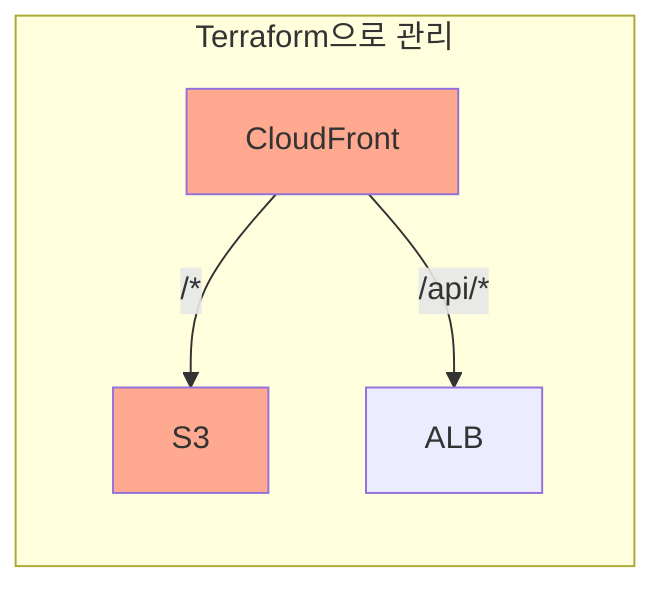
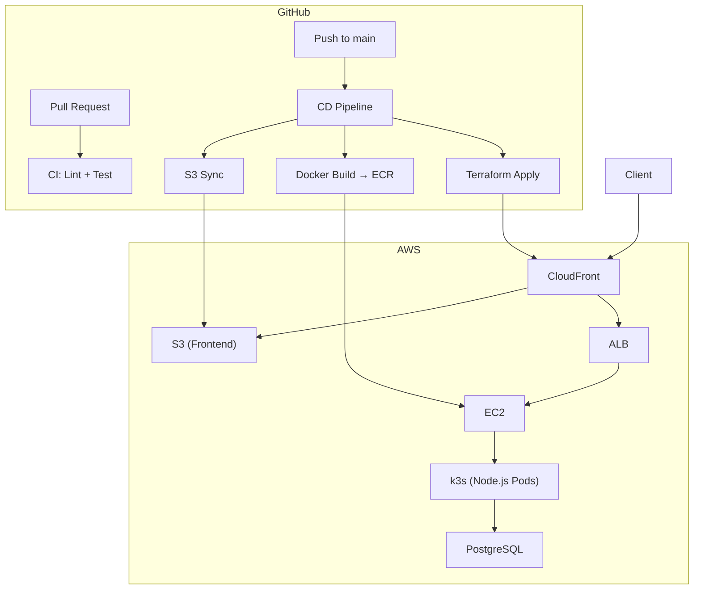

+++
title = "8. Terraform + GitHub Actions"
description = "Terraform으로 인프라를 코드화하고, GitHub Actions로 CI/CD 파이프라인을 구축합니다."
icon = "article"
weight = 380
+++

지금까지 AWS 리소스를 콘솔에서 클릭으로 만들었어요. 하지만 프로덕션에서는 이렇게 하지 않아요. **왜?**

- 누가 어떤 리소스를 만들었는지 추적할 수 없어요.
- 동일한 환경을 재현하려면 처음부터 다시 클릭해야 해요.
- 실수로 설정 하나 잘못 누르면 돌이킬 수 없어요.

**Terraform**은 인프라를 코드(IaC, Infrastructure as Code)로 관리하는 도구예요. 그리고 **GitHub Actions**로 코드 변경 시 자동으로 테스트, 빌드, 배포하는 CI/CD 파이프라인을 구축할 거예요.

이번 주가 마지막 세션입니다. Session 1에서 시작한 서버가 이제 **코드로 관리되고, 자동으로 배포**되는 수준에 도달합니다!

## 공부할 내용

### 1. Terraform

#### IaC란?

인프라를 수동 설정 대신 **코드 파일로 정의**하고, 이 코드를 실행해서 인프라를 생성/수정/삭제하는 것이에요. 코드이므로 Git으로 버전 관리, 코드 리뷰, 롤백이 가능해요.

#### Terraform 핵심 개념

- **Provider:** 어떤 클라우드/서비스를 관리할지 (aws, gcp, azure, kubernetes 등)
- **Resource:** 관리할 인프라 요소 (aws_instance, aws_s3_bucket 등)
- **State:** 현재 인프라의 상태를 저장하는 파일. Terraform은 이 파일과 코드를 비교해서 변경점을 계산해요.
- **Data Source:** 이미 존재하는 리소스를 읽어오는 것 (직접 만들지 않음)

#### 핵심 명령어

```bash
terraform init     # Provider 다운로드, 초기화
terraform plan     # 변경 사항 미리보기 (실제 적용 안 함)
terraform apply    # 변경 사항 적용
terraform destroy  # 리소스 전체 삭제
```

`plan` → `apply` 워크플로우가 핵심이에요. **항상 plan으로 먼저 확인**하고 apply하세요.

#### HCL 문법 (기초)

```hcl
# Provider 설정
provider "aws" {
  region = "ap-northeast-2"
}

# S3 버킷 생성
resource "aws_s3_bucket" "frontend" {
  bucket = "my-todo-frontend-bucket"
}

# 변수
variable "environment" {
  default = "dev"
}

# 출력
output "bucket_arn" {
  value = aws_s3_bucket.frontend.arn
}
```

#### 참고 자료

- **[44bits "테라폼(Terraform)이란?"](https://www.44bits.io/ko/keyword/terraform)**: Terraform의 배경부터 튜토리얼까지 정리한 글입니다.
- **[인프런 Terraform & AWS 101 "Terraform 기본"](https://terraform101.inflearn.devopsart.dev/preparation/terraform-basic/)**: 용어와 명령어 정리.
- **[AWS Provider 공식 문서](https://registry.terraform.io/providers/hashicorp/aws/latest/docs)**: Terraform으로 AWS 리소스를 관리할 때 필수 문서.

### 2. GitHub Actions

#### CI/CD란?

- **CI (Continuous Integration):** 코드가 merge될 때 자동으로 테스트, 빌드하여 문제를 조기 발견
- **CD (Continuous Delivery/Deployment):** 빌드된 결과물을 자동으로 스테이징/프로덕션에 배포

#### GitHub Actions 핵심 개념

- **Workflow:** `.github/workflows/` 디렉토리의 YAML 파일. CI/CD 파이프라인 정의.
- **Event:** Workflow를 실행하는 트리거 (push, pull_request, schedule 등)
- **Job:** Workflow 안의 실행 단위. 각 Job은 별도의 VM에서 실행.
- **Step:** Job 안의 개별 작업. 셸 명령어 또는 Action 사용.
- **Action:** 재사용 가능한 자동화 단위 (예: `actions/checkout`, `docker/build-push-action`)
- **Secret:** 민감한 정보 (API 키, 토큰 등)를 안전하게 저장

#### 참고 자료

- **["CI/CD란 무엇일까?"](https://jud00.tistory.com/entry/CICD%EB%9E%80-%EB%AC%B4%EC%97%87%EC%9D%BC%EA%B9%8C)**: CI/CD 개념을 정리한 글입니다.
- **[Dalseo "GitHub Actions의 소개와 핵심 개념"](https://www.daleseo.com/github-actions-basics/)**: GitHub Actions의 구성 요소를 정리한 글입니다.
- **[Dalseo "GitHub Actions 첫 워크플로우 생성해보기"](https://www.daleseo.com/github-actions-first-workflow/)**: 실습과 함께 배우는 글입니다.

---

## 프로젝트 실습

### Part 1: Terraform으로 S3 + CloudFront 코드화

Session 6에서 콘솔로 만들었던 S3와 CloudFront를 Terraform 코드로 재현해볼 거예요.



#### Terraform 설치

```bash
# Mac
brew install terraform

# Linux
# https://developer.hashicorp.com/terraform/install 참고

# VSCode 확장: "HashiCorp Terraform" 설치
```

#### AWS CLI 설정 확인

```bash
aws configure
# Session 5에서 만든 IAM User의 Access Key 사용
```

#### S3 Bucket 생성

```hcl
# main.tf
provider "aws" {
  region = "ap-northeast-2"
}

resource "aws_s3_bucket" "frontend" {
  bucket = "my-todo-frontend-unique-name"  # 전 세계 유일해야 함
}

resource "aws_s3_bucket_website_configuration" "frontend" {
  bucket = aws_s3_bucket.frontend.id
  index_document { suffix = "index.html" }
}
```

```bash
terraform init    # Provider 설치
terraform plan    # 변경 사항 확인
terraform apply   # 적용 (yes 입력)
```

AWS Console에서 S3 버킷이 생성되었는지 확인하세요!

#### S3에 파일 업로드

```hcl
resource "aws_s3_object" "index" {
  bucket       = aws_s3_bucket.frontend.id
  key          = "index.html"
  source       = "frontend/index.html"
  content_type = "text/html"
  etag         = filemd5("frontend/index.html")
}
```

#### Bucket Policy + Public Access

```hcl
resource "aws_s3_bucket_public_access_block" "frontend" {
  bucket                  = aws_s3_bucket.frontend.id
  block_public_acls       = false
  block_public_policy     = false
  ignore_public_acls      = false
  restrict_public_buckets = false
}

data "aws_iam_policy_document" "frontend_public" {
  statement {
    principals {
      type        = "*"
      identifiers = ["*"]
    }
    actions   = ["s3:GetObject"]
    resources = ["${aws_s3_bucket.frontend.arn}/*"]
  }
}

resource "aws_s3_bucket_policy" "frontend" {
  bucket = aws_s3_bucket.frontend.id
  policy = data.aws_iam_policy_document.frontend_public.json
}
```

#### CloudFront Distribution

```hcl
resource "aws_cloudfront_distribution" "main" {
  enabled             = true
  default_root_object = "index.html"

  # S3 Origin
  origin {
    domain_name = aws_s3_bucket_website_configuration.frontend.website_endpoint
    origin_id   = "s3-frontend"
    custom_origin_config {
      http_port              = 80
      https_port             = 443
      origin_protocol_policy = "http-only"
      origin_ssl_protocols   = ["TLSv1.2"]
    }
  }

  # ALB Origin (기존 ALB를 data source로 참조)
  origin {
    domain_name = data.aws_lb.existing_alb.dns_name
    origin_id   = "alb-api"
    custom_origin_config {
      http_port              = 80
      https_port             = 443
      origin_protocol_policy = "http-only"
      origin_ssl_protocols   = ["TLSv1.2"]
    }
  }

  default_cache_behavior {
    allowed_methods        = ["GET", "HEAD"]
    cached_methods         = ["GET", "HEAD"]
    target_origin_id       = "s3-frontend"
    viewer_protocol_policy = "allow-all"
    forwarded_values {
      query_string = false
      cookies { forward = "none" }
    }
  }

  ordered_cache_behavior {
    path_pattern           = "/api/*"
    allowed_methods        = ["DELETE", "GET", "HEAD", "OPTIONS", "PATCH", "POST", "PUT"]
    cached_methods         = ["GET", "HEAD"]
    target_origin_id       = "alb-api"
    viewer_protocol_policy = "allow-all"
    forwarded_values {
      query_string = true
      cookies { forward = "all" }
    }
  }

  restrictions {
    geo_restriction { restriction_type = "none" }
  }
  viewer_certificate {
    cloudfront_default_certificate = true
  }
}

# 기존 ALB를 data source로 참조
data "aws_lb" "existing_alb" {
  name = "your-alb-name"
}
```

```bash
terraform plan    # CloudFront 생성 내용 확인
terraform apply   # 적용 (생성에 몇 분 소요)
```



### Part 2: GitHub Actions CI/CD 파이프라인

두 개의 Workflow를 작성합니다.



#### Workflow 1: CI (ci.yml)

`main` 브랜치에 push 또는 Pull Request가 생성되면 실행.

```yaml
# .github/workflows/ci.yml
name: CI

on:
  push:
    branches: [main]
  pull_request:
    branches: [main]

jobs:
  lint-and-test:
    runs-on: ubuntu-latest
    steps:
      - uses: actions/checkout@v4
      - uses: actions/setup-node@v4
        with:
          node-version: '20'
      - run: npm ci
      - run: npm test        # 테스트 스크립트가 있다면
```

> CodeQL을 추가해서 보안 취약점도 자동으로 검사해보세요. 참고: [GitHub CodeQL 문서](https://docs.github.com/ko/code-security/code-scanning)

#### Workflow 2: CD (cd.yml)

`main` 브랜치에 push되면 실행. 세 개의 Job으로 구성.

```yaml
# .github/workflows/cd.yml
name: CD

on:
  push:
    branches: [main]

jobs:
  deploy-frontend:
    runs-on: ubuntu-latest
    permissions:
      id-token: write
      contents: read
    steps:
      - uses: actions/checkout@v4
      - uses: aws-actions/configure-aws-credentials@v4
        with:
          role-to-assume: ${{ secrets.AWS_ROLE_ARN }}
          aws-region: ap-northeast-2
      - run: aws s3 sync frontend/ s3://${{ secrets.S3_BUCKET_NAME }}

  build-and-push:
    runs-on: ubuntu-latest
    permissions:
      id-token: write
      contents: read
    steps:
      - uses: actions/checkout@v4
      - uses: aws-actions/configure-aws-credentials@v4
        with:
          role-to-assume: ${{ secrets.AWS_ROLE_ARN }}
          aws-region: ap-northeast-2
      - uses: aws-actions/amazon-ecr-login@v2
      - uses: docker/build-push-action@v5
        with:
          push: true
          tags: ${{ secrets.ECR_REPO }}:${{ github.sha }}

  terraform:
    needs: [deploy-frontend, build-and-push]
    runs-on: ubuntu-latest
    permissions:
      id-token: write
      contents: read
    steps:
      - uses: actions/checkout@v4
      - uses: aws-actions/configure-aws-credentials@v4
        with:
          role-to-assume: ${{ secrets.AWS_ROLE_ARN }}
          aws-region: ap-northeast-2
      - uses: hashicorp/setup-terraform@v3
      - run: terraform init
      - run: terraform apply -auto-approve
```

#### OIDC 인증 설정 (중요!)

GitHub Actions에서 AWS에 접근할 때 Access Key 대신 **OpenID Connect(OIDC)**를 사용하세요. 더 안전해요.

1. AWS IAM > Identity Providers > Add Provider > OpenID Connect
   - URL: `https://token.actions.githubusercontent.com`
   - Audience: `sts.amazonaws.com`
2. IAM Role 생성 > Trust Policy에 GitHub repo 지정
3. 필요한 권한 정책 연결 (S3, ECR, CloudFront 등)
4. GitHub Repo > Settings > Secrets에 `AWS_ROLE_ARN` 저장

#### Terraform Backend (중요!)

Terraform의 state 파일을 로컬이 아닌 **S3에 저장**해야 팀원들과 공유하고, CI/CD에서도 사용할 수 있어요.

```hcl
terraform {
  backend "s3" {
    bucket = "my-terraform-state-bucket"
    key    = "todo-app/terraform.tfstate"
    region = "ap-northeast-2"
  }
}
```

---

## 전체 아키텍처 최종 모습



---

## 여기서부터는 어디로?

8주간 배운 내용을 기반으로 더 공부할 수 있는 방향들이에요.

### 바로 다음 단계

- **Terraform 심화:** 모듈, 워크스페이스, Remote State, 팀 워크플로우
- **K8s 심화:** Ingress Controller, HPA (Auto Scaling), PersistentVolume, RBAC
- **모니터링:** Prometheus + Grafana, OpenTelemetry, ELK Stack
- **보안:** IAM 심화, Network Policy, Pod Security Standards

### 중기 목표

- **EKS:** 매니지드 Kubernetes로 마이그레이션
- **ArgoCD:** GitOps 기반 CD
- **Service Mesh:** Istio / Linkerd
- **비용 최적화:** Spot Instance, Karpenter, 리소스 Right-sizing

### 추천 자료

- **[The 12-Factor App](https://12factor.net/ko/)**: 클라우드 네이티브 앱의 철학. 꼭 읽어보세요.
- **[Kubernetes The Hard Way](https://github.com/kelseyhightower/kubernetes-the-hard-way)**: K8s를 밑바닥부터 구축해보는 고급 튜토리얼.
- **[AWS Well-Architected Framework](https://aws.amazon.com/ko/architecture/well-architected/)**: AWS 아키텍처 설계의 모범 사례.
- **[DevOps Roadmap](https://roadmap.sh/devops)**: 전체적인 학습 로드맵.

---

수고하셨습니다! 🎉 Session 1에서 `node server.js`로 시작한 서버가 이제 Docker로 컨테이너화되고, Kubernetes 위에서 실행되고, Terraform으로 관리되고, GitHub Actions로 자동 배포되고 있어요. 이게 인프라의 핵심 흐름입니다.
