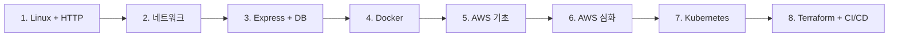

+++
title = "Getting Started"
description = "인프라 스터디는 이렇게 진행되어요."
icon = "article"
weight = 300
+++

인프라 팀은 서버 운영, 인프라 구축, 배포 자동화, 모니터링, 보안 등을 담당하는 팀이에요.

한 학기 동안 아래와 같은 내용을 배울 거예요.

- Linux 서버 관리와 네트워크 기초
- 간단한 서버 제작 (Node.js, Express)
- 데이터베이스 연동 (PostgreSQL)
- 컨테이너 기반 가상화 (Docker, Docker Compose)
- 클라우드 서비스 (AWS — IAM, VPC, EC2, S3, CloudFront, ALB)
- 컨테이너 오케스트레이션 (Kubernetes)
- 인프라 프로비저닝과 CI/CD (Terraform, GitHub Actions)

Linux와 네트워크 기초를 다진 뒤, 간단한 서버를 만들어보고, Docker로 컨테이너화한 다음 AWS에 배포할 거예요. Kubernetes로 오케스트레이션하고, Terraform으로 인프라를 코드화하고, GitHub Actions로 전 과정을 자동화할 거예요.

## 스터디 흐름

## 스터디 방식

- **매주 1회, 1~2시간** 진행해요.
- 매 세션마다 **공부할 내용**과 **프로젝트 실습**이 있어요.
- 공부할 내용은 참고 자료를 제공하지만, 자유롭게 검색해서 공부해도 괜찮아요.
- 프로젝트 실습은 **하나의 앱**을 매주 발전시키는 형태로 진행돼요. Session 1에서 만든 서버가 Session 8에서는 Kubernetes 위에서 CI/CD로 자동 배포됩니다.

## 환경

- **실습 서버:** 팀에서 Ubuntu 서버를 제공해요. SSH로 접속해서 사용합니다.
- **로컬 환경:** 본인 노트북에서도 개발해요. Windows는 WSL 설치를 권장합니다.
- **AWS:** Free Tier 계정을 각자 생성해요. (Session 5 전에 미리 만들어두세요!)

더 많은 내용을 배워보고 싶은 분들은 아래의 DevOps Roadmap을 참고해보세요.
https://roadmap.sh/devops
