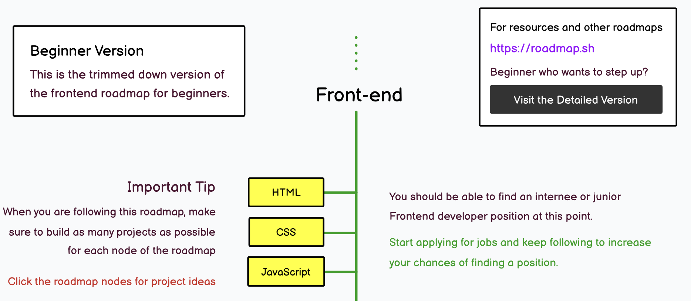

# HTML, CSS

> ref. [frontend roadmap (beginner version) - roadmap.sh](https://roadmap.sh/frontend?r=frontend-beginner)

HTML, CSS는 프론트엔드 개발의 기초이예요! 해당 내용들을 잘 이해하지 않고 넘어가면 나중에 큰 어려움을 겪을 수 있어요. 양이 많지만 꼭 시간 투자를 아낌없이 해서 이해하고 넘어가 보아요! 😄

## 공부할 내용 📚

여러분의 공부를 돕기 위해 준비한 자료들이에요. 따라서 꼭 준비된 자료만 공부할 필요는 없어요! 여러분이 공부하는 방식에 맞게 공부하고 정리해오고 과제만 잘 수행하면 돼요! 😄

### HTML

HTML은 "프로그래밍 언어"가 아닌 마크업 언어로 웹 페이지의 구조를 정의하는 언어에요. 여러분이 브라우저 주소창에 "skku.edu"을 입력해서 서버에 요청을 보내면 가장 먼저 받는 파일이 HTML 문법으로 작성된 파일이예요. 즉 웹의 시작이니 정말 중요하겠죠!

- [HTML 100초 소개](https://www.youtube.com/watch?v=ok-plXXHlWw&ab_channel=Fireship)
  - HTML이 무엇인지, 왜 중요한지 100초만에 알려줘요!
- [생활코딩 HTML 강의](https://opentutorials.org/course/2039)
  - 정보로서의 HTML 이전까지의 내용은 필수! 이후 내용은 선택!
- [HTML 시작하기 - MDN](https://developer.mozilla.org/ko/docs/Learn/HTML/Introduction_to_HTML/Getting_started)
- [HTML reference - MDN](https://developer.mozilla.org/ko/docs/Web/HTML)
  - HTML 요소들에 대한 설명이 잘 되어있어요. 필요할 때 참고하면 좋아요!

### CSS

HTML에서 구조화를 잘 했지만 아직은 단순히 문서일 뿐이에요. CSS는 HTML 문서를 꾸며주는 역할을 해요. CSS를 잘 이해하고 사용하면 웹 페이지를 성능적으로도, 디자인적으로도 더욱 효과적으로 만들 수 있어요!

- [CSS 100초 소개](https://www.youtube.com/watch?v=OEV8gMkCHXQ&ab_channel=Fireship)
  - CSS가 무엇인지, 왜 중요한지 100초만에 알려줘요!
- [생활코딩 CSS 강의](https://opentutorials.org/course/2418)
  - 레이아웃까지의 내용은 필수! 이후 내용은 선택!
- [Flex - 1분코딩](https://studiomeal.com/archives/197)
  - Flex는 CSS의 레이아웃을 잡는 속성이에요. 정말 중요하니 꼭 공부해보세요!
- [Flexbox froggy](https://flexboxfroggy.com/)
  - 재미있게 Flex를 공부할 수 있는 게임이에요!
- [CSS 시작하기 - MDN](https://developer.mozilla.org/ko/docs/Learn/CSS/First_steps)
- [CSS reference - MDN](https://developer.mozilla.org/ko/docs/Web/CSS)

## 과제 📝

추가예정
