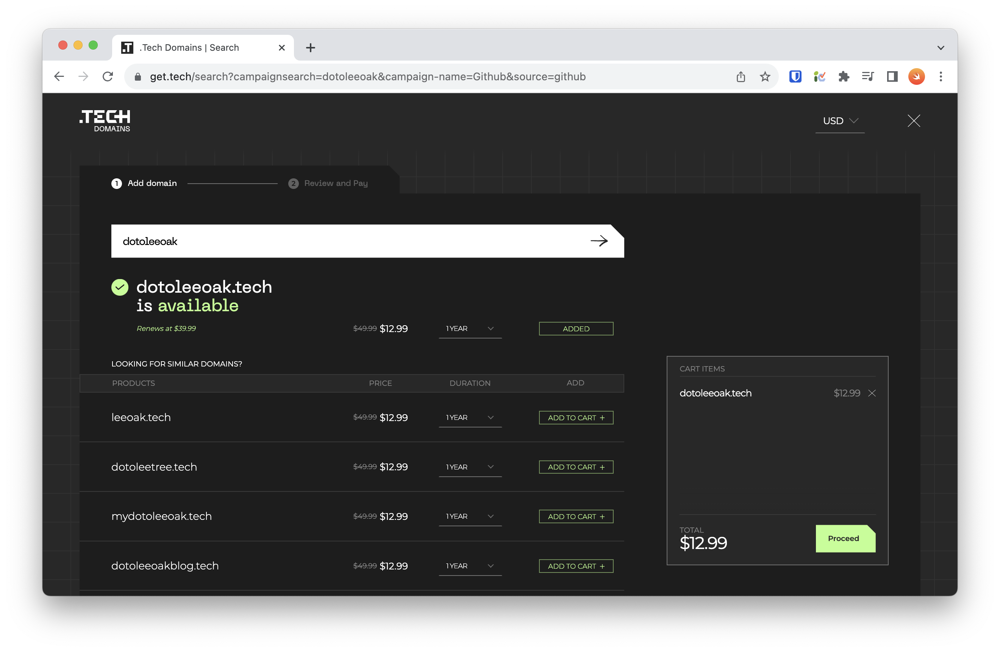
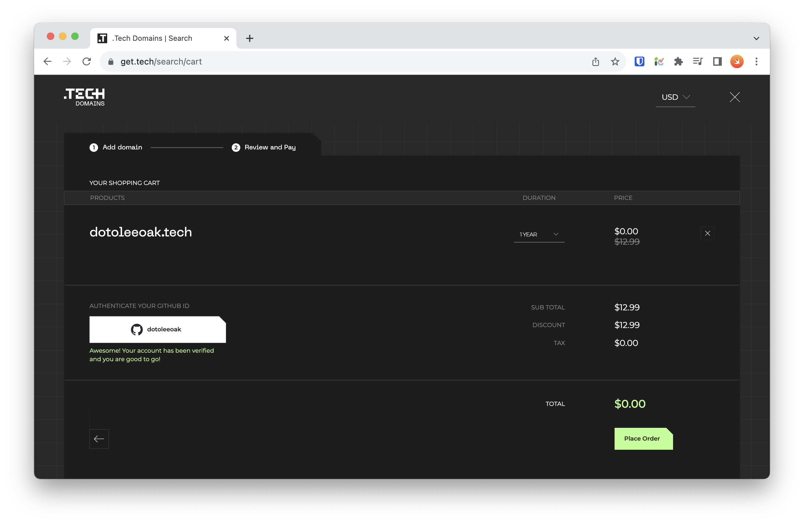
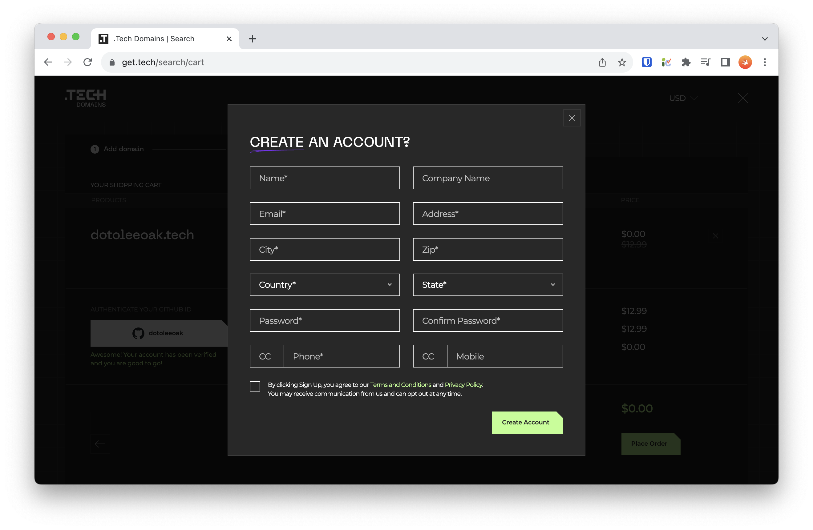
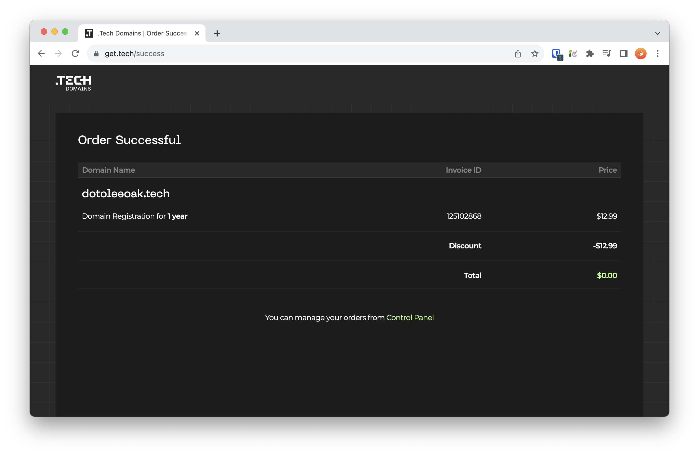
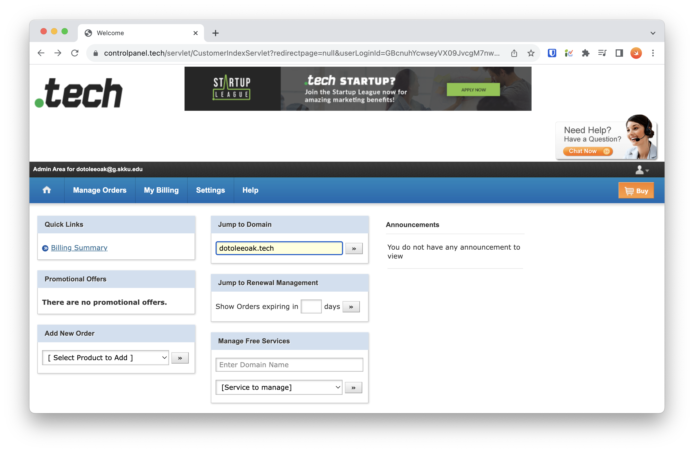
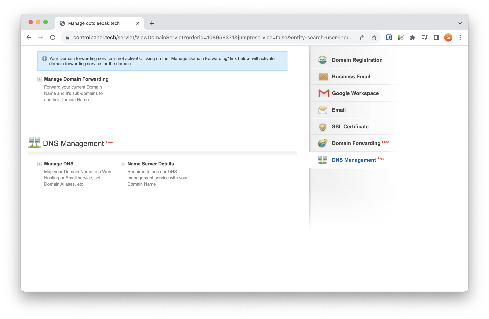
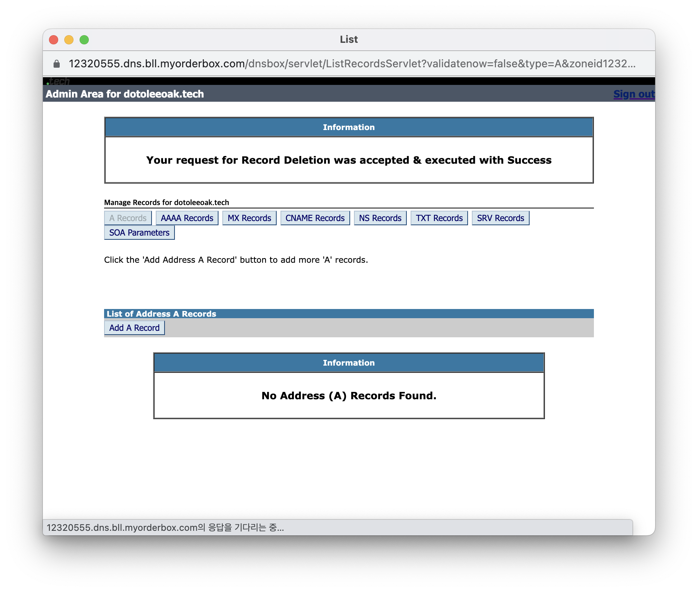
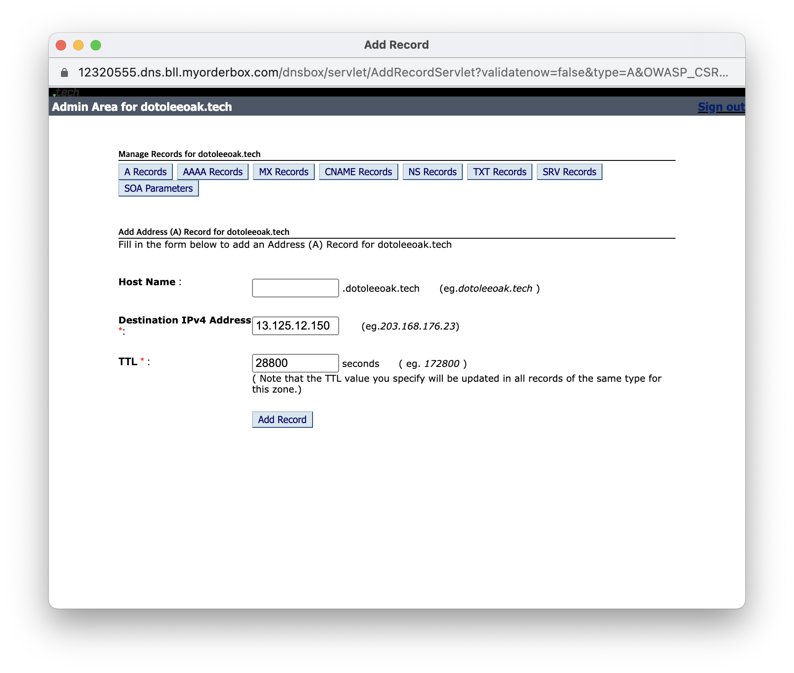
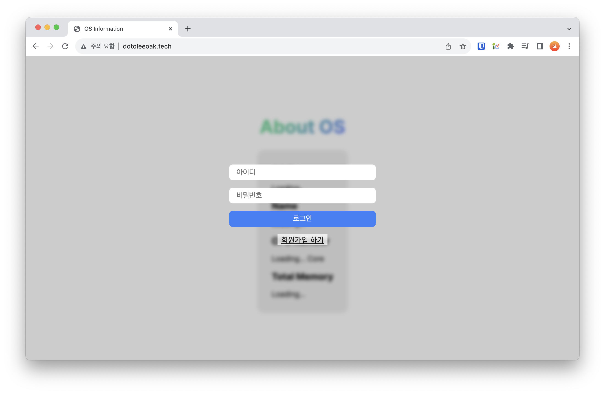

# 무료 도메인 등록 (.tech)

## TECH 도메인 등록 방법

### 1. GitHub Student Developer Pack

아래 링크에서 GitHub Student Developer Pack에 등록합니다.  
https://education.github.com/pack

### 2. .TECH 등록

아래 링크에서 .TECH를 찾아 "Get access by connecting your GitHub account on .TECH"를 클릭하세요.  
https://education.github.com/pack/offers#offers

  

### 3. 도메인 선택

원하는 도메인 이름을 입력하고 검색한 다음, 'Add to Cart'를 선택하고 'Proceed'를 누르세요. (표시된 금액은 결제되지 않아요)

  

### 4. 도메인 할인 (GitHub 연결)

GitHub 연결을 선택하고, GitHub 계정으로 로그인하세요. (GitHub Student Developer Pack에 등록한 계정이어야 합니다.) 연결이 완료되면 'Place Order'를 누르세요.

  

### 5. 회원가입

표시된 정보를 입력하고, 'Create Account'를 누르세요.

  

### 6. 도메인 등록 완료

아래와 같은 창이 표시되면 등록이 완료됩니다!

  

## IP 주소 등록 (A record)

### 1. TECH domain 홈페이지

[TECH domain 홈페이지](https://get.tech)로 이동해서 Account를 클릭하세요. 로그인되어있지 않다면 로그인도 진행해주세요.

  

### 2. Account 페이지

Jump to Domain 칸에 본인의 도메인을 입력해주세요.

  

### 3. 도메인 관리 페이지

도메인 관리 페이지에서 아래로 스크롤하여 DNS 관리 페이지로 이동합니다. 'Manage DNS'를 클릭하세요.

  

### 4. DNS 관리 페이지

DNS record들을 확인할 수 있습니다. (예: \<record-name>.dotoleeoak.tech) A record는 IPv4 주소를 등록할 수 있는 record입니다. 'Add A record'를 클릭하세요.

  

### 5. A record 등록

Root 도메인(\<domain-name>.tech)을 등록하기 위해 Host Name은 빈 칸으로 둡니다. Destination에 원하는 IP 주소(Elastic IP 등)를 등록하고, 'Add Record'를 누르세요.

  

### 6. 동작 확인

도메인이 잘 동작하는지 확인합니다.

  

